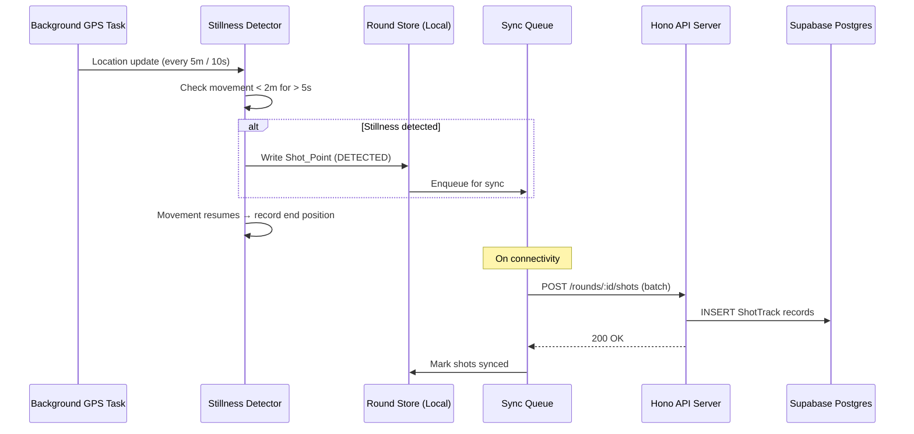
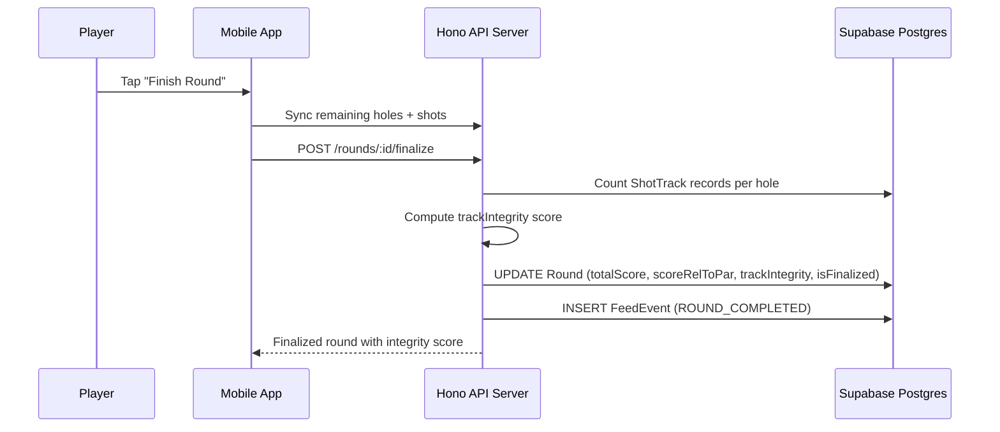

# Design Document: Scoring UX Overhaul

## Overview

This overhaul replaces the current `ScoringScreen.tsx` with a streamlined, one-thumb scoring experience and adds passive GPS shot tracking. The existing screen uses a zero-defaulted +/− counter, inline secondary stats, no color feedback, and manual hole navigation. The new design introduces:

1. **Par-defaulted stepper** — strokes start at par, not zero, reducing taps for most holes
2. **Collapsible secondary stats** — putts, fairway hit, GIR are optional toggles below the stepper
3. **Instant color feedback** — each hole row gets a background tint based on score-to-par relationship
4. **Auto-advance** — confirming a score automatically moves to the next hole
5. **Swipe navigation** — horizontal swipe between holes for correction
6. **Passive shot detection** — 5-second GPS stillness flags shot locations invisibly
7. **Hole confirmation sheet** — bottom sheet shows detected shots with quick adjust before save
8. **Track integrity scoring** — computed metric for dispute resolution during Stripe settlement

### Key Design Decisions

- **Pure `getScoreColor` function**: Color mapping is extracted into a pure, testable utility function rather than inline logic. This ensures consistency across the scorecard, confirmation sheet, and any future surfaces.
- **Stillness detection on-device**: The 5-second / 2-meter threshold runs entirely in the background task callback. No server round-trip is needed to detect a shot — only to sync it later.
- **ShotTrack as append-only log**: Shot points are immutable after round finalization. Corrections before finalization create new `CORRECTED` entries rather than mutating existing ones.
- **Confirmation sheet over modal**: A bottom sheet (not a modal dialog) keeps the player in context and meets the "no modals during scoring" requirement.
- **Expo Go fallback**: Since `react-native-maps` requires a dev build, the map section degrades to a text-based shot count indicator in Expo Go.
- **Batch shot sync**: Shot points sync via `POST /rounds/:id/shots` in batches to minimize network requests, reusing the existing `syncQueue` pattern.

## Architecture

### Scoring Screen Layout

```
┌─────────────────────────────────┐
│  Header: Course Name + Sync     │
├─────────────────────────────────┤
│  GPS Section                    │
│  ┌───────────────────────────┐  │
│  │ Map / Shot Trail / Dots   │  │
│  │ Distance: F | C | B       │  │
│  │ (or "3 shots detected")   │  │
│  └───────────────────────────┘  │
├─────────────────────────────────┤
│  Live Scorecard (scrollable)    │
│  ┌─ ─ ─ ─ ─ ─ ─ ─ ─ ─ ─ ─ ┐  │
│  │ H1  Par 4  ■ 4  #dfe4dd  │  │
│  │ H2  Par 3  ■ 2  #e9c349  │  │
│  │ H3  Par 5  ■ 6  #ffb4ab  │  │
│  │ ...                       │  │
│  └─ ─ ─ ─ ─ ─ ─ ─ ─ ─ ─ ─ ┘  │
├─────────────────────────────────┤
│  Current Hole Stepper           │
│  ┌───────────────────────────┐  │
│  │  Hole 4 · Par 4           │  │
│  │  [ − ]    4    [ + ]      │  │
│  └───────────────────────────┘  │
├─────────────────────────────────┤
│  Secondary Stats (collapsed)    │
│  [ Putts ] [ FW ] [ GIR ]      │
├─────────────────────────────────┤
│  [ Confirm Score → ]            │
└─────────────────────────────────┘

  ↕ Swipe left/right between holes

  On confirm → Confirmation Sheet slides up:
  ┌─────────────────────────────────┐
  │  Mini map with shot dots        │
  │  Strokes: [−] 4 [+]            │
  │  Putts: [−] 2 [+]              │
  │  [ FW ] [ GIR ]                │
  │  [ Save ]                       │
  └─────────────────────────────────┘
```

### Shot Detection Data Flow



### Round Finalization with Track Integrity



## Components and Interfaces

### New / Modified Mobile Components

#### 1. ScoringScreen (rewrite)
Replaces the existing `ScoringScreen.tsx`. Layout order: GPS section → live scorecard → stepper → secondary stats → confirm button. Supports horizontal swipe via `PanResponder` or a pager for hole navigation.

#### 2. ScoreStepperCard
Displays the current hole's stepper. Initializes strokes to par value. Plus/minus buttons with 48×48dp touch targets. Strokes value displayed at 40pt+ Manrope bold. Minimum strokes value is 1.

#### 3. HoleRow
A single row in the live scorecard. Shows hole number, par, strokes, and a `getScoreColor`-derived background tint at reduced opacity. Tappable — navigates to that hole for correction. Minimum height 40dp with 8dp vertical spacing.

#### 4. SecondaryStatsPanel
Collapsed by default. Contains:
- Putts: small +/− stepper
- Fairway Hit: boolean toggle chip
- GIR: boolean toggle chip

Does not block score submission. Values are optional and default to null.

#### 5. HoleConfirmationSheet
Bottom sheet that slides up on score confirm. Shows:
- Mini map with shot dots (or text fallback in Expo Go)
- Strokes stepper defaulting to detected shot count
- Putts counter, FW toggle, GIR toggle
- Save button that persists all data and auto-advances

#### 6. ShotTrailOverlay
Renders on the map section:
- Movement path as dotted line (`#3f4943` at 40% opacity)
- Shot points as solid dots (`#84d7af`)
- Updates in real time from store

#### 7. getScoreColor utility
Pure function: `getScoreColor(strokes: number, par: number): string`

```typescript
export function getScoreColor(strokes: number, par: number): string {
  const diff = strokes - par;
  if (diff <= -2) return '#e9c349'; // eagle or better — gold
  if (diff === -1) return '#84d7af'; // birdie — green
  if (diff === 0)  return '#dfe4dd'; // par — neutral
  if (diff === 1)  return '#ffb4ab'; // bogey — light red
  return '#ff7961';                  // double bogey+ — darker red
}
```

#### 8. Stillness Detector (in backgroundLocation.ts)
Runs inside the existing `TaskManager.defineTask` callback. Maintains a buffer of recent locations. When movement < 2m over 5 consecutive seconds, emits a `DETECTED` shot point to the round store. When movement resumes, records the departure coordinate as the shot end position.

### Updated Round Store Interface

```typescript
export interface LocalHoleState {
  holeNumber: number;
  strokes: number;
  putts: number | null;
  fairwayHit: boolean | null;
  gir: boolean | null;
  penalties: number;
  par: number;
  gpsTimestamp: string | null;
  synced: boolean;
}

export interface ShotPoint {
  id: string;
  holeNumber: number;
  shotNumber: number;
  startLatitude: number;
  startLongitude: number;
  endLatitude: number | null;
  endLongitude: number | null;
  timestamp: string;
  eventType: 'DETECTED' | 'MANUAL' | 'CORRECTED' | 'ROUND_START' | 'ROUND_END';
  accuracy: number;
  altitude: number | null;
  synced: boolean;
}

export interface ActiveRound {
  id: string;
  courseId: string | null;
  courseName: string;
  coursePar: number;
  startedAt: string;
  currentHole: number;
  holes: LocalHoleState[];
  shotPoints: ShotPoint[];
}

interface RoundState {
  activeRound: ActiveRound | null;
  syncStatus: SyncStatus;

  startRound: (round: Omit<ActiveRound, 'currentHole' | 'holes' | 'shotPoints'>) => void;
  updateHole: (holeNumber: number, data: Partial<Omit<LocalHoleState, 'holeNumber'>>) => void;
  advanceHole: () => void;
  goToHole: (holeNumber: number) => void;
  addShotPoint: (point: Omit<ShotPoint, 'synced'>) => void;
  updateShotPoint: (id: string, data: Partial<ShotPoint>) => void;
  removeShotPoint: (id: string) => void;
  markShotsSynced: (ids: string[]) => void;
  finalizeRound: () => void;
  clearRound: () => void;
  setSyncStatus: (status: SyncStatus) => void;
  markHoleSynced: (holeNumber: number) => void;
}
```

Key changes from current store:
- `LocalHoleState` adds `fairwayHit`, `gir` (nullable booleans), and `putts` becomes nullable
- `ActiveRound` adds `shotPoints` array
- New actions: `goToHole`, `addShotPoint`, `updateShotPoint`, `removeShotPoint`, `markShotsSynced`
- `createDefaultHoles` initializes `strokes` to par value (not zero)

### API Endpoints (New)

| Method | Path | Description |
|--------|------|-------------|
| POST | `/rounds/:id/shots` | Batch upload shot points for a round |
| GET | `/rounds/:id/shots` | Get all shot points for a round (dispute resolution) |

#### POST /rounds/:id/shots

Request body:
```typescript
{
  shots: Array<{
    id: string;
    holeNumber: number;
    shotNumber: number;
    startLatitude: number;
    startLongitude: number;
    endLatitude: number | null;
    endLongitude: number | null;
    timestamp: string; // ISO 8601
    eventType: 'DETECTED' | 'MANUAL' | 'CORRECTED' | 'ROUND_START' | 'ROUND_END';
    accuracy: number;
    altitude: number | null;
  }>
}
```

Validation:
- Round must exist and not be finalized
- Each shot must reference a valid hole number (1–18)
- Upserts by `id` to handle retries

#### GET /rounds/:id/shots

Returns all `ShotTrack` records for the round, ordered by `holeNumber` then `shotNumber`. Used during dispute resolution.

### Updated Finalize Endpoint

The existing `POST /rounds/:id/finalize` is extended to compute `trackIntegrity`:

```typescript
function computeTrackIntegrity(
  shots: ShotTrack[],
  holes: Hole[],
  totalHoles: number
): number {
  const totalStrokes = holes.reduce((sum, h) => sum + h.strokes, 0);
  const totalShots = shots.filter(s =>
    s.eventType === 'DETECTED' || s.eventType === 'MANUAL' || s.eventType === 'CORRECTED'
  ).length;

  // Coverage: how many of the 18 holes have at least one shot point
  const holesWithShots = new Set(shots.map(s => s.holeNumber)).size;
  const coverageRatio = holesWithShots / totalHoles;

  // Shot match: ratio of tracked shots to confirmed strokes
  const shotMatchRatio = totalStrokes > 0
    ? Math.min(totalShots / totalStrokes, 1.0)
    : 0;

  // Time gap penalty: check for gaps > 10 minutes between consecutive shots
  const sorted = [...shots].sort((a, b) =>
    new Date(a.timestamp).getTime() - new Date(b.timestamp).getTime()
  );
  let gapPenalty = 0;
  for (let i = 1; i < sorted.length; i++) {
    const gap = new Date(sorted[i].timestamp).getTime() - new Date(sorted[i - 1].timestamp).getTime();
    if (gap > 10 * 60 * 1000) gapPenalty += 0.05; // 5% penalty per large gap
  }

  const raw = (coverageRatio * 0.4) + (shotMatchRatio * 0.5) + (0.1 * (gapPenalty === 0 ? 1 : 0));
  return Math.max(0, Math.min(1, raw - gapPenalty));
}
```

The score is stored as a float 0.0–1.0 on the Round record. Rounds with integrity ≥ 0.8 show "verified", 0.5–0.79 show "partially verified", below 0.5 show "unverified".

## Data Models

### New Prisma Model: ShotTrack

```prisma
enum ShotEventType {
  DETECTED
  MANUAL
  CORRECTED
  ROUND_START
  ROUND_END
}

model ShotTrack {
  id             String        @id @default(uuid())
  roundId        String
  holeNumber     Int
  shotNumber     Int
  startLatitude  Float
  startLongitude Float
  endLatitude    Float?
  endLongitude   Float?
  timestamp      DateTime
  eventType      ShotEventType
  accuracy       Float
  altitude       Float?
  createdAt      DateTime      @default(now())

  round Round @relation(fields: [roundId], references: [id])

  @@index([roundId])
  @@index([roundId, holeNumber])
  @@index([timestamp])
}
```

### Updated Round Model

Add to the existing `Round` model:

```prisma
model Round {
  // ... existing fields ...
  trackIntegrity Float?        // 0.0–1.0, computed on finalization

  shots          ShotTrack[]   // new relation
}
```

### Updated Hole Model

Add optional fields to the existing `Hole` model:

```prisma
model Hole {
  // ... existing fields ...
  fairwayHit Boolean?
  gir        Boolean?
}
```

### Updated Local Storage Schema

```typescript
interface LocalHoleState {
  holeNumber: number;
  strokes: number;        // initialized to par, not zero
  putts: number | null;   // nullable — optional stat
  fairwayHit: boolean | null;
  gir: boolean | null;
  penalties: number;
  par: number;
  gpsTimestamp: string | null;
  synced: boolean;
}

interface ShotPoint {
  id: string;             // UUID generated on device
  holeNumber: number;
  shotNumber: number;
  startLatitude: number;
  startLongitude: number;
  endLatitude: number | null;
  endLongitude: number | null;
  timestamp: string;
  eventType: 'DETECTED' | 'MANUAL' | 'CORRECTED' | 'ROUND_START' | 'ROUND_END';
  accuracy: number;
  altitude: number | null;
  synced: boolean;
}

interface ActiveRound {
  id: string;
  courseId: string | null;
  courseName: string;
  coursePar: number;
  startedAt: string;
  currentHole: number;
  holes: LocalHoleState[];
  shotPoints: ShotPoint[];
}
```

### Background Location Task Updates

The existing `backgroundLocation.ts` task is updated to:

1. Maintain a rolling buffer of the last 5 location samples
2. On each location update, check if all samples in the buffer are within 2 meters of each other and span ≥ 5 seconds
3. If stillness is detected and no shot was already flagged at this position, call `useRoundStore.getState().addShotPoint(...)` with a `DETECTED` event
4. When subsequent movement exceeds 2 meters, update the most recent shot point's `endLatitude`/`endLongitude`
5. GPS config: `accuracy: Location.Accuracy.High`, `distanceInterval: 5`, `timeInterval: 10000` (10 seconds)


## Correctness Properties

*A property is a characteristic or behavior that should hold true across all valid executions of a system — essentially, a formal statement about what the system should do. Properties serve as the bridge between human-readable specifications and machine-verifiable correctness guarantees.*

### Property 1: Par-defaulted hole initialization

*For any* course par value and any hole number (1–18), when a round is started, the `strokes` field for that hole in the round store SHALL equal the par value assigned to that hole.

**Validates: Requirements 1.1, 8.5**

### Property 2: Stepper arithmetic with floor constraint

*For any* current strokes value and any sequence of increment (+1) and decrement (−1) operations, the resulting strokes value SHALL equal `max(1, strokes + sum_of_deltas)`. The strokes value SHALL never be less than 1.

**Validates: Requirements 1.2, 1.3, 1.4**

### Property 3: Score color mapping completeness

*For any* valid strokes value (≥ 1) and any valid par value (≥ 1), `getScoreColor(strokes, par)` SHALL return:
- `#e9c349` when `strokes - par ≤ -2`
- `#84d7af` when `strokes - par = -1`
- `#dfe4dd` when `strokes - par = 0`
- `#ffb4ab` when `strokes - par = 1`
- `#ff7961` when `strokes - par ≥ 2`

Additionally, calling `getScoreColor` twice with the same inputs SHALL return the same result (referential transparency).

**Validates: Requirements 4.2, 4.3, 4.4, 4.5, 4.6, 9.2, 9.3, 9.4, 9.5, 9.6, 9.7, 6.3**

### Property 4: Auto-advance on non-final hole

*For any* hole number from 1 to 17, when the player confirms a score, the round store's `currentHole` SHALL advance to `holeNumber + 1`. When the hole number is 18, `currentHole` SHALL remain at 18 (finalization flow takes over).

**Validates: Requirements 5.1, 5.2, 12.6**

### Property 5: Score correction preserves store consistency

*For any* previously scored hole, when the player navigates to that hole via `goToHole(n)` and updates the strokes value, the round store SHALL reflect the new strokes for that hole, and the running total score (sum of all hole strokes) SHALL equal the sum of the individual hole strokes values.

**Validates: Requirements 6.1, 6.2**

### Property 6: Hole update marks unsynced and pending

*For any* hole in an active round, when `updateHole` is called with any data (strokes, putts, fairwayHit, gir, or penalties), the hole's `synced` flag SHALL be set to `false` and the store's `syncStatus` SHALL be set to `'pending'`.

**Validates: Requirements 8.2, 8.3**

### Property 7: Untouched secondary stats default to null

*For any* hole where the player confirms a score without interacting with the secondary stats panel, the `putts`, `fairwayHit`, and `gir` fields SHALL remain `null` in the round store.

**Validates: Requirements 3.3**

### Property 8: Boolean stat toggles record values

*For any* hole, when `updateHole` is called with `fairwayHit: true`, the hole's `fairwayHit` SHALL be `true`. When called with `gir: true`, the hole's `gir` SHALL be `true`. Toggling back to `false` SHALL set the respective field to `false`.

**Validates: Requirements 3.5, 3.6**

### Property 9: Stillness detection algorithm

*For any* sequence of GPS coordinates where all points are within 2 meters of each other and the time span exceeds 5 seconds, the stillness detector SHALL emit exactly one `DETECTED` shot point. *For any* sequence where movement exceeds 2 meters within the 5-second window, no shot point SHALL be emitted.

**Validates: Requirements 10.2**

### Property 10: Shot departure coordinate recording

*For any* detected shot point, when subsequent GPS movement exceeds 2 meters from the shot location, the shot point's `endLatitude` and `endLongitude` SHALL be updated to the first coordinate that exceeds the 2-meter threshold.

**Validates: Requirements 10.6**

### Property 11: Shot points written to store immediately

*For any* shot point (whether `DETECTED`, `MANUAL`, or `CORRECTED`), calling `addShotPoint` SHALL immediately add the point to the `shotPoints` array in the round store with `synced: false`, and the point SHALL be retrievable from the store without any network operation.

**Validates: Requirements 10.3, 13.4, 16.4**

### Property 12: Confirmation sheet defaults strokes to detected shot count

*For any* hole with N shot points of type `DETECTED`, `MANUAL`, or `CORRECTED`, the confirmation sheet's strokes stepper SHALL default to N.

**Validates: Requirements 12.2**

### Property 13: Shot point add/remove round trip

*For any* active round, adding a shot point via `addShotPoint` and then removing it via `removeShotPoint` with the same `id` SHALL result in a `shotPoints` array identical to the state before the addition.

**Validates: Requirements 13.2, 13.3**

### Property 14: Shot point immutability after finalization

*For any* finalized round, the API SHALL reject all `POST /rounds/:id/shots` requests and all shot point modification/deletion requests with an error response. The shot point data SHALL remain unchanged.

**Validates: Requirements 14.5**

### Property 15: Track integrity computation

*For any* round with a set of shot points and confirmed hole strokes, `computeTrackIntegrity` SHALL return a value between 0.0 and 1.0 inclusive. When the total shot points are fewer than the total confirmed strokes, the integrity score SHALL be strictly less than 1.0. When all 18 holes have at least one shot point and the shot count matches total strokes with no time gaps > 10 minutes, the integrity score SHALL be ≥ 0.8.

**Validates: Requirements 14.6, 15.1, 15.4**

### Property 16: Shot point schema completeness

*For any* shot point stored in the system, it SHALL contain all required fields: `id`, `holeNumber` (1–18), `shotNumber` (≥ 1), `startLatitude`, `startLongitude`, `timestamp`, `eventType` (one of `DETECTED`, `MANUAL`, `CORRECTED`, `ROUND_START`, `ROUND_END`), and `accuracy`. Optional fields `endLatitude`, `endLongitude`, and `altitude` MAY be null.

**Validates: Requirements 14.1, 14.2**

### Property 17: Offline scoring resilience

*For any* round store state where `syncStatus` is `'offline'`, calling `updateHole` with valid data SHALL succeed without throwing an error, the hole data SHALL be persisted locally, and the hole SHALL be marked as unsynced.

**Validates: Requirements 8.4**

## Error Handling

### GPS Permission Denied
- If foreground location permission is denied, show an alert explaining why GPS is needed and allow manual scoring without distance data.
- If background location permission is denied, scoring continues normally but shot tracking is disabled. The round is marked as "unverified" (`trackIntegrity` will be 0 or very low). A persistent warning banner appears at the top of the scoring screen.

### Network Failures During Sync
- The existing `syncQueue.ts` pattern handles network failures gracefully — holes and shot points are queued locally and retried on reconnect.
- The `POST /rounds/:id/shots` endpoint is idempotent (upsert by `id`), so retries are safe.
- If finalization fails due to network, the round remains in local storage and the player can retry.

### Invalid Shot Point Data
- Shot points with missing required fields are rejected by the API with a 400 response. The sync queue skips invalid entries and logs them.
- Shot points referencing hole numbers outside 1–18 are rejected.
- Shot points for finalized rounds are rejected with a 409 Conflict response.

### Store Corruption Recovery
- If the persisted round store fails to deserialize (e.g., schema migration), the store falls back to a clean state. The player sees "No active round" and can start fresh.
- SecureStore has a 2KB limit per key on some platforms. If the `shotPoints` array grows too large, it should be chunked or moved to AsyncStorage for the shot data specifically.

### Background Task Failures
- If the background location task crashes or is killed by the OS, the foreground location watcher continues to work when the app is active.
- On task restart, the stillness detector resets its buffer — no false shots are emitted from stale data.

## Testing Strategy

### Unit Tests

Unit tests cover specific examples, edge cases, and integration points:

- `getScoreColor` edge cases: strokes = 1, par = 1 (par); strokes = 1, par = 5 (eagle); strokes = 10, par = 3 (triple bogey+)
- `createDefaultHoles` with various course pars (54, 72, 71) — verify all 18 holes get correct par distribution
- `computeTrackIntegrity` with known inputs: full coverage round, empty round, round with time gaps
- Round store `startRound` initializes holes with par-defaulted strokes
- Round store `goToHole` navigates to correct hole and preserves existing data
- Round store `addShotPoint` / `removeShotPoint` with edge cases (duplicate IDs, empty array)
- Stillness detector with exact boundary conditions: exactly 2m movement, exactly 5 seconds
- API endpoint `POST /rounds/:id/shots` with valid batch, empty batch, finalized round
- API endpoint `GET /rounds/:id/shots` returns ordered results
- Confirmation sheet default strokes calculation with zero shots, mixed event types

### Property-Based Tests

Property-based tests use `fast-check` (the standard PBT library for TypeScript/JavaScript). Each test runs a minimum of 100 iterations and is tagged with its design property reference.

Configuration:
```typescript
import fc from 'fast-check';
// Each property test: fc.assert(fc.property(...), { numRuns: 100 })
```

Each correctness property (Properties 1–17) maps to exactly one property-based test. Tests are tagged with comments:

```typescript
// Feature: scoring-ux-overhaul, Property 1: Par-defaulted hole initialization
// Feature: scoring-ux-overhaul, Property 2: Stepper arithmetic with floor constraint
// Feature: scoring-ux-overhaul, Property 3: Score color mapping completeness
// ... etc.
```

Key generators needed:
- `arbPar`: integer 3–5 (realistic golf pars)
- `arbStrokes`: integer 1–15 (realistic stroke range)
- `arbHoleNumber`: integer 1–18
- `arbCoordinate`: `{ latitude: float(-90, 90), longitude: float(-180, 180) }`
- `arbShotPoint`: record with all required fields using the above generators
- `arbLocationSequence`: array of `{ latitude, longitude, timestamp }` for stillness detection testing
- `arbStepperDeltas`: array of +1/-1 integers for stepper arithmetic testing

Both unit tests and property tests are complementary — unit tests catch concrete edge cases while property tests verify universal correctness across randomized inputs.
