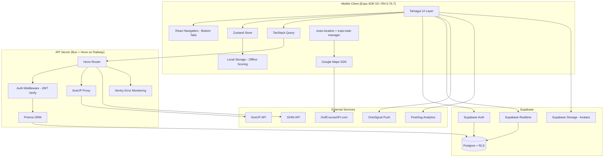
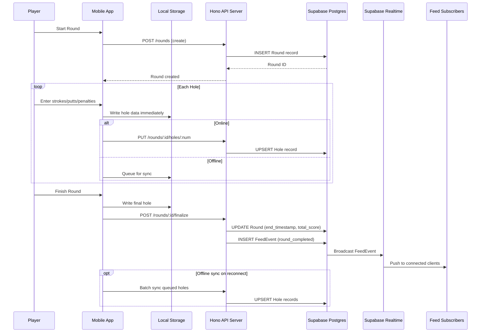
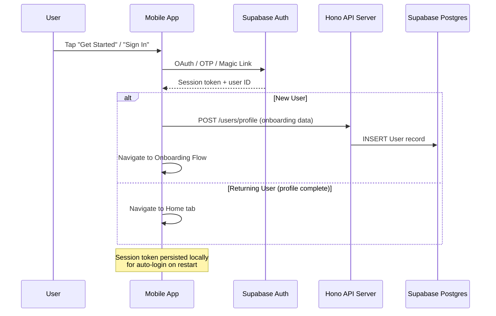

# Design Document: Sticks M1 Foundation

## Overview

Sticks M1 Foundation delivers the foundational layer of the Sticks golf platform — a social golf app built on two pillars: a white-label tournament/league engine for organizations, and a social feed that drives daily player engagement. M1 establishes the core loop: authentication, onboarding, the full Supabase data model, navigation shell, GPS-assisted scoring, a basic leaderboard, a basic social feed, and read-only tee time search via foreUP.

The system is a three-tier architecture: an Expo/React Native mobile client, a Bun + Hono API server on Railway, and a Supabase Postgres database with Realtime subscriptions. The mobile client is offline-first for scoring, uses Zustand for local state, TanStack Query for server state, and Tamagui for the design system. All foreUP API calls are proxied through the API server to protect credentials.

### Key Design Decisions

- **Offline-first scoring**: Round data is written to local storage immediately and synced to Supabase when connectivity is available. Local data is source of truth during a round.
- **FeedEvent as first-class event bus**: Every scorable action emits a FeedEvent record. This is the foundational pattern for all future event types.
- **Course_Data_Provider abstraction**: Course data is fetched through an interface that can be swapped from GolfCourseAPI.com (dev/beta) to iGolf (production) without touching rendering logic.
- **API proxy for foreUP**: The mobile client never holds foreUP API keys. All tee time queries go through the Hono API server.
- **Prisma for schema management**: All database migrations are version-controlled through Prisma, deployed against Supabase Postgres.
- **Row Level Security on all tables**: Every Supabase table has RLS policies restricting access to authenticated users.

## Architecture

### System Architecture Diagram



### Data Flow: Round Scoring (Offline-First)



### Data Flow: Authentication



## Components and Interfaces

### Mobile Client Components

#### 1. Auth Module
- **AuthScreen**: Landing screen with "Get Started" and "Sign In" buttons
- **SignUpScreen / SignInScreen**: Apple, Google, Phone, Email auth options
- **useAuth hook**: Wraps Supabase Auth, exposes `signIn`, `signUp`, `signOut`, `session`
- **AuthGuard**: HOC that redirects unauthenticated users to AuthScreen

#### 2. Onboarding Module
- **OnboardingWizard**: 5-step sequential flow with progress bar
  - Step 1: Profile Basics (first name, last name, avatar upload)
  - Step 2: Handicap Setup (link GHIN, manual entry, or skip)
  - Step 3: Home Course Selection (search + nearby list)
  - Step 4: Play Style (Competitive / Casual / Social)
  - Step 5: Player Discovery (contacts, Instagram, X/Twitter — all skippable)
- **useOnboarding hook**: Tracks current step, persists partial progress, resumes on relaunch

#### 3. Navigation Shell
- **BottomTabNavigator**: 5 tabs — Home, Play, Leaderboard, Bets, Profile
  - Icons: `home`, `golf_course`, `leaderboard`, `payments`, `person` (Material Symbols Outlined)
  - Active tab highlighted with primary color `#84d7af`
  - Hidden during auth, onboarding, and active GPS scoring
- **TopAppBar**: Profile avatar, "STICKS" wordmark, notifications icon (Home screen)

#### 4. GPS Scoring Module
- **RoundSessionManager**: Creates/manages Round_Session lifecycle
- **GPSLayer**: Google Maps SDK view with Course_Data_Provider overlay
  - Displays distance to pin: front, center, back (yards)
- **ScorecardControls**: Stroke counter (+/-), putts counter (+/-), penalty button per hole
- **ScoreTracker**: Running score relative to par, holes completed count
- **BackgroundLocationTask**: expo-task-manager + expo-location for iOS background tracking
- **OfflineSyncQueue**: Writes to local storage first, syncs to API when online

#### 5. Course Data Provider Interface

```typescript
interface CourseDataProvider {
  searchCourses(query: string, lat: number, lng: number): Promise<Course[]>;
  getCourseDetails(courseId: string): Promise<CourseDetails>;
  getHoleLayout(courseId: string, holeNumber: number): Promise<HoleLayout>;
  getDistanceToPin(
    courseId: string,
    holeNumber: number,
    playerLat: number,
    playerLng: number
  ): Promise<{ front: number; center: number; back: number }>;
}

interface Course {
  id: string;
  name: string;
  location: { lat: number; lng: number; city: string; state: string };
  imageUrl?: string;
  holeCount: number;
  par: number;
}

interface HoleLayout {
  holeNumber: number;
  par: number;
  yardage: number;
  greenCenter: { lat: number; lng: number };
  greenFront: { lat: number; lng: number };
  greenBack: { lat: number; lng: number };
}
```

#### 6. Leaderboard Module
- **LeaderboardScreen**: Ranked list of users by best score relative to par
- **LeaderboardEntry**: Player name, avatar, score relative to par, total score, course name, rank
- **MyPositionCard**: Sticky card showing current user's rank (visible while scrolling)
- **TimeFilter**: Week / Month / All Time toggle
- **useLeaderboard hook**: Subscribes to Supabase Realtime for live updates

#### 7. Social Feed Module
- **FeedScreen**: Reverse-chronological FeedEvent list on Home tab
- **FeedCard**: Round completion card — player name, avatar, course, score, relative score, timestamp
- **LiveMatchTicker**: Horizontal scroll section showing active rounds in progress
- **FeedFilters**: Following / Local / Global tab toggles
- **useFeed hook**: Subscribes to Supabase Realtime, supports pagination via TanStack Query

#### 8. Tee Time Search Module
- **TeeTimeScreen**: Date picker + list of available tee times
- **DatePicker**: Horizontal scrollable date selector
- **TeeTimeCard**: Time, course name, available slots, price, "Book" button (triggers "Coming in M2" message)
- **useTeeTimeSearch hook**: Queries API server which proxies to foreUP

#### 9. Profile Module
- **ProfileScreen**: Hero section (name, home course, handicap), stats bento grid, round history list
- **StatsBentoGrid**: Fairways Hit %, GIR %, Average Putts — computed from completed rounds
- **RoundHistoryList**: Course name, date, total score, relative score, GPS verification badge
- **RoundDetailScreen**: Full hole-by-hole scorecard view

### API Server Endpoints

| Method | Path | Description |
|--------|------|-------------|
| POST | `/auth/verify` | Verify Supabase JWT, return user context |
| GET | `/users/me` | Get current user profile |
| PUT | `/users/me` | Update user profile (onboarding + edits) |
| POST | `/users/me/avatar` | Upload avatar to Supabase Storage |
| POST | `/rounds` | Create a new Round_Session |
| PUT | `/rounds/:id/holes/:num` | Upsert hole scoring data |
| POST | `/rounds/:id/finalize` | Finalize round, compute totals, emit FeedEvent |
| GET | `/rounds/me` | Get current user's round history |
| GET | `/rounds/:id` | Get round detail with all holes |
| GET | `/feed` | Query FeedEvents with pagination + scope filter |
| GET | `/leaderboard` | Query leaderboard with time filter |
| GET | `/tee-times` | Proxy search to foreUP API |
| GET | `/courses/search` | Search courses via Course_Data_Provider |
| POST | `/ghin/lookup` | Look up GHIN index for a user |

### Auth Middleware

Every API request (except public health check) passes through auth middleware that:
1. Extracts the `Authorization: Bearer <token>` header
2. Verifies the JWT against Supabase Auth
3. Attaches the authenticated user ID to the request context
4. Returns 401 if token is missing or invalid


## Data Models

### Prisma Schema (M1 Scope — Full App Entity Set)

All tables are created in M1 to establish the foundation. Tables not actively used in M1 (e.g., Bet, Tournament, Season) are seeded with the correct schema so future milestones build on them without restructuring.

```prisma
// enums
enum PlayStyle {
  COMPETITIVE
  CASUAL
  SOCIAL
}

enum MembershipTier {
  FREE
  FAIRWAY
  EAGLE
  TOUR
}

enum ScoringMode {
  STROKE_PLAY
  MATCH_PLAY
  STABLEFORD
  SCRAMBLE
  BEST_BALL
}

enum FeedEventType {
  ROUND_COMPLETED
  LEADERBOARD_MOVE
  BET_SETTLED
  TOURNAMENT_RESULT
  CREW_ACTIVITY
  RIVALRY_MILESTONE
  BRACKET_ADVANCEMENT
}

enum BetStatus {
  ACTIVE
  SETTLED
  DISPUTED
  CANCELLED
}

enum BookingStatus {
  AVAILABLE
  HELD
  BOOKED
  CANCELLED
}

enum TournamentStatus {
  DRAFT
  REGISTRATION_OPEN
  IN_PROGRESS
  COMPLETED
  CANCELLED
}

// Core Entities

model User {
  id              String           @id @default(uuid())
  authId          String           @unique // Supabase Auth UID
  firstName       String
  lastName        String
  avatarUrl       String?
  ghinIndex       Float?
  homeCourseId    String?
  homeCourseName  String?
  playStyle       PlayStyle?
  membershipTier  MembershipTier   @default(FREE)
  onboardingStep  Int              @default(0) // 0 = not started, 5 = complete
  createdAt       DateTime         @default(now())
  updatedAt       DateTime         @updatedAt

  rounds          RoundPlayer[]
  feedEvents      FeedEvent[]
  tournamentEntries TournamentEntry[]
  betsAsPlayer    BetPlayer[]
  crewMemberships CrewMember[]
  following       Follow[]         @relation("follower")
  followers       Follow[]         @relation("following")
}

model Follow {
  id          String   @id @default(uuid())
  followerId  String
  followingId String
  createdAt   DateTime @default(now())

  follower    User     @relation("follower", fields: [followerId], references: [id])
  following   User     @relation("following", fields: [followingId], references: [id])

  @@unique([followerId, followingId])
}

model Organization {
  id          String       @id @default(uuid())
  name        String
  logoUrl     String?
  colorScheme Json?        // { primary, secondary, accent }
  domain      String?      // custom subdomain
  tier        String?      // league, tour, institution, enterprise
  createdAt   DateTime     @default(now())
  updatedAt   DateTime     @updatedAt

  tournaments Tournament[]
  seasons     Season[]
  feedEvents  FeedEvent[]
}

model Tournament {
  id              String           @id @default(uuid())
  organizationId  String
  seasonId        String?
  name            String
  format          ScoringMode      @default(STROKE_PLAY)
  handicapMode    String?          // gross, net, both
  status          TournamentStatus @default(DRAFT)
  flightConfig    Json?
  prizePool       Float?
  startDate       DateTime?
  endDate         DateTime?
  createdAt       DateTime         @default(now())
  updatedAt       DateTime         @updatedAt

  organization    Organization     @relation(fields: [organizationId], references: [id])
  season          Season?          @relation(fields: [seasonId], references: [id])
  entries         TournamentEntry[]
  rounds          Round[]
}

model TournamentEntry {
  id            String     @id @default(uuid())
  tournamentId  String
  userId        String
  flight        String?
  tee           String?
  paymentStatus String?
  score         Int?
  bracketPos    Int?
  createdAt     DateTime   @default(now())

  tournament    Tournament @relation(fields: [tournamentId], references: [id])
  user          User       @relation(fields: [userId], references: [id])

  @@unique([tournamentId, userId])
}

model Season {
  id              String       @id @default(uuid())
  organizationId  String
  name            String
  pointsSystem    Json?
  dropWorstRounds Int?
  startDate       DateTime?
  endDate         DateTime?
  createdAt       DateTime     @default(now())
  updatedAt       DateTime     @updatedAt

  organization    Organization @relation(fields: [organizationId], references: [id])
  tournaments     Tournament[]
}

model Round {
  id              String       @id @default(uuid())
  courseId        String?      // external course reference
  courseName      String
  coursePar       Int          @default(72)
  tournamentId    String?
  scoringMode     ScoringMode  @default(STROKE_PLAY)
  startedAt       DateTime     @default(now())
  endedAt         DateTime?
  totalScore      Int?
  scoreRelToPar   Int?
  isFinalized     Boolean      @default(false)
  createdAt       DateTime     @default(now())
  updatedAt       DateTime     @updatedAt

  tournament      Tournament?  @relation(fields: [tournamentId], references: [id])
  holes           Hole[]
  players         RoundPlayer[]
}

model RoundPlayer {
  id       String @id @default(uuid())
  roundId  String
  userId   String

  round    Round  @relation(fields: [roundId], references: [id])
  user     User   @relation(fields: [userId], references: [id])

  @@unique([roundId, userId])
}

model Hole {
  id           String   @id @default(uuid())
  roundId      String
  holeNumber   Int
  strokes      Int      @default(0)
  putts        Int      @default(0)
  penalties    Int      @default(0)
  gpsTimestamp DateTime?
  par          Int?
  createdAt    DateTime @default(now())
  updatedAt    DateTime @updatedAt

  round        Round    @relation(fields: [roundId], references: [id])

  @@unique([roundId, holeNumber])
}

model FeedEvent {
  id              String        @id @default(uuid())
  eventType       FeedEventType
  actorId         String
  organizationId  String?       // optional org scope
  payload         Json          // flexible event data
  createdAt       DateTime      @default(now())

  actor           User          @relation(fields: [actorId], references: [id])
  organization    Organization? @relation(fields: [organizationId], references: [id])
}

model Bet {
  id            String    @id @default(uuid())
  format        String    // skins, nassau, wolf, etc.
  pot           Float     @default(0)
  status        BetStatus @default(ACTIVE)
  stripeIntent  String?
  roundId       String?
  createdAt     DateTime  @default(now())
  updatedAt     DateTime  @updatedAt

  players       BetPlayer[]
}

model BetPlayer {
  id     String @id @default(uuid())
  betId  String
  userId String

  bet    Bet    @relation(fields: [betId], references: [id])
  user   User   @relation(fields: [userId], references: [id])

  @@unique([betId, userId])
}

model Crew {
  id        String       @id @default(uuid())
  name      String
  imageUrl  String?
  createdAt DateTime     @default(now())
  updatedAt DateTime     @updatedAt

  members   CrewMember[]
}

model CrewMember {
  id     String @id @default(uuid())
  crewId String
  userId String

  crew   Crew   @relation(fields: [crewId], references: [id])
  user   User   @relation(fields: [userId], references: [id])

  @@unique([crewId, userId])
}

model TeeTime {
  id            String        @id @default(uuid())
  courseName    String
  datetime      DateTime
  availableSpots Int
  price         Float
  bookingStatus BookingStatus @default(AVAILABLE)
  foreupRefId   String?       // foreUP external reference
  createdAt     DateTime      @default(now())
  updatedAt     DateTime      @updatedAt
}
```

### Row Level Security Policies

All tables enforce RLS. Key policies for M1:

| Table | Policy | Rule |
|-------|--------|------|
| User | Users can read any profile | `SELECT` for `auth.role() = 'authenticated'` |
| User | Users can update own profile | `UPDATE` where `auth.uid() = auth_id` |
| Round | Authenticated users can read all rounds | `SELECT` for `auth.role() = 'authenticated'` |
| Round | Users can create own rounds | `INSERT` where player is `auth.uid()` |
| Hole | Authenticated users can read holes | `SELECT` for `auth.role() = 'authenticated'` |
| Hole | Round owner can write holes | `INSERT/UPDATE` where round belongs to `auth.uid()` |
| FeedEvent | All authenticated users can read | `SELECT` for `auth.role() = 'authenticated'` |
| FeedEvent | Only API server (service role) can insert | `INSERT` for `auth.role() = 'service_role'` |
| TeeTime | All authenticated users can read | `SELECT` for `auth.role() = 'authenticated'` |

### Local Storage Schema (Offline Scoring)

```typescript
interface LocalRoundState {
  roundId: string;
  courseId: string;
  courseName: string;
  coursePar: number;
  startedAt: string; // ISO timestamp
  currentHole: number;
  holes: LocalHoleState[];
  syncStatus: 'synced' | 'pending' | 'offline';
}

interface LocalHoleState {
  holeNumber: number;
  strokes: number;
  putts: number;
  penalties: number;
  gpsTimestamp: string | null;
  synced: boolean;
}
```

