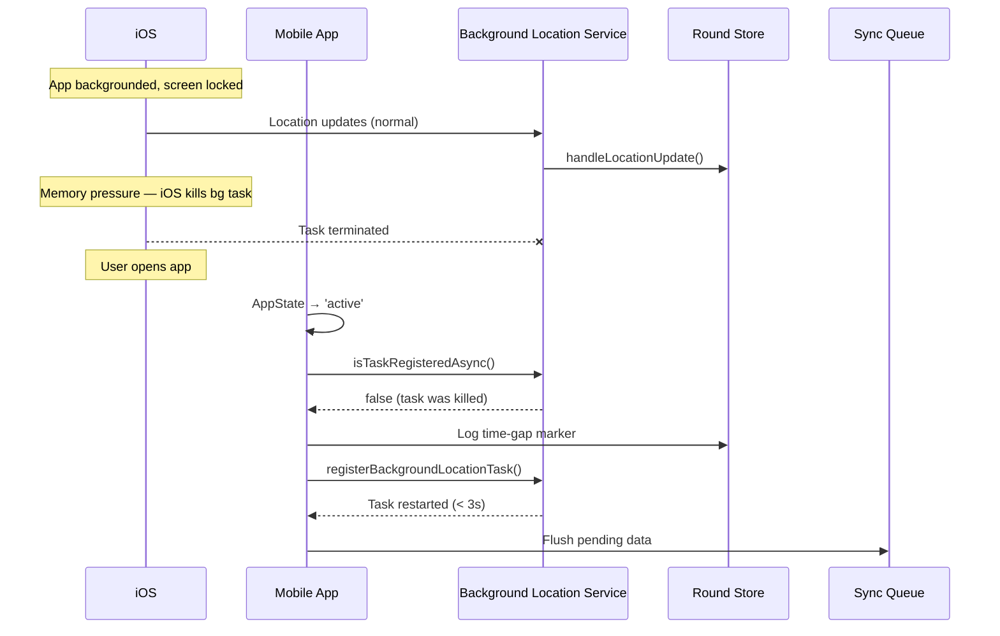
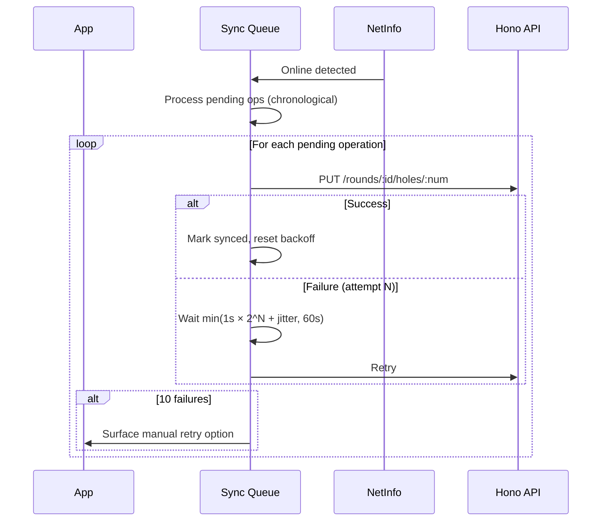
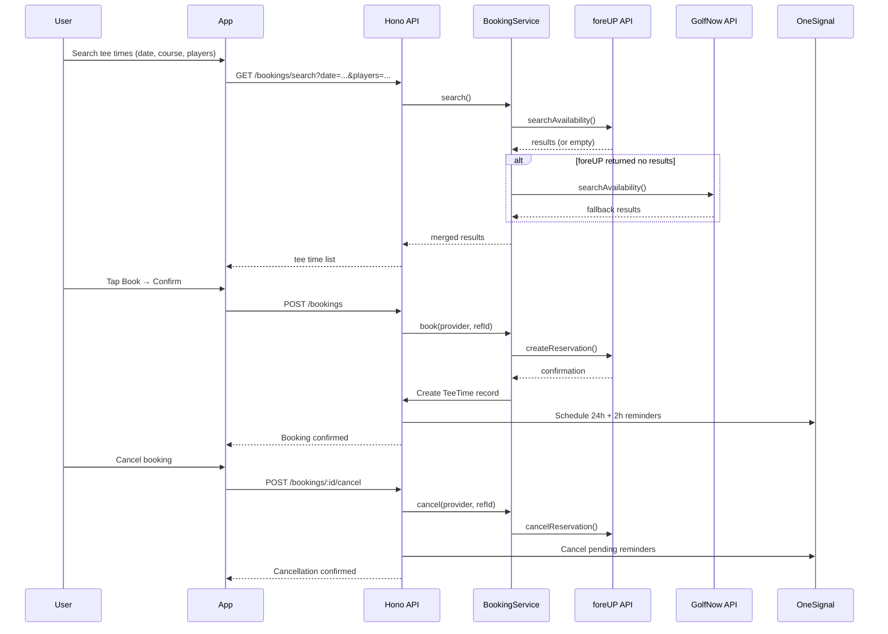

# Design Document: Sticks M2 — GPS Scoring, Course Geometry & Tee Time Booking

## Overview

M2 hardens the GPS scoring pipeline and adds the two revenue-critical features that make Sticks a real product: end-to-end tee time booking and course geometry overlays. M1 shipped background location with stillness detection, offline scoring via Zustand/AsyncStorage, a Google Maps placeholder, and mock tee time search. M2 takes each to production quality.

The work breaks into six architectural areas:

1. **Background location recovery** — detect iOS task termination on foreground re-entry, restart the location task within 3 seconds, log time-gap markers, and resume the round from persisted state.
2. **Sync queue hardening** — exponential backoff (1s → 60s cap), conflict resolution (local wins), corruption recovery from AsyncStorage snapshots, independent hole/shot pipelines.
3. **Course geometry provider** — extend `CourseDataProvider` with `getHoleGeometry(courseId)` returning fairway/green/hazard polygons per hole, local caching via AsyncStorage with TTL, and a normalized schema that works for both GolfCourseAPI.com and future iGolf.
4. **Map overlay rendering** — replace the GPS placeholder in `ScoringScreen` with `react-native-maps` `<Polygon>` and `<Marker>` components, rendering fairway/green/hazard shapes and live distance-to-pin from the user's GPS position.
5. **Booking service** — a provider-pattern abstraction on the API server (`BookingProvider` interface) with `ForeUpProvider` and `GolfNowProvider` implementations, proxied through Hono routes. The mobile client gets search → book → confirm → cancel → refund flows.
6. **Push notifications** — OneSignal integration for scheduling 24-hour and 2-hour tee time reminders, with cancellation cleanup and retry-once on failure.

### Key Design Decisions

- **Local-wins conflict resolution**: During a round, the golfer's phone is the source of truth. Server data is overwritten on conflict. Conflicts are logged for debugging but never block sync.
- **Exponential backoff with jitter**: Prevents thundering herd on reconnect. Base 1s, factor 2x, cap 60s, ±25% jitter.
- **Provider pattern for booking**: `BookingProvider` interface lets foreUP and GolfNow coexist behind a single `BookingService`. The API server routes to the correct provider based on the tee time's `provider` field.
- **react-native-maps polygons (dev build required)**: `react-native-maps` is already in `package.json` (1.20.1). Polygon overlays require a dev build (not Expo Go). This is acceptable since GPS scoring already requires `expo-location` background mode.
- **OneSignal as a new dependency**: OneSignal provides scheduled delivery, segment targeting, and a REST API for server-side scheduling. The mobile SDK handles device registration; the API server handles scheduling/cancellation via OneSignal REST.
- **Geometry caching in AsyncStorage**: Course geometry is cached locally with a 7-day TTL. This avoids network requests for repeat rounds at the same course. The cache key is `course-geometry-{courseId}`.
- **Prisma migrations for schema changes**: All new columns and models go through Prisma migrations. No raw SQL outside of RLS policies.

## Architecture

### System Architecture (M2 Additions)

```mermaid
graph TB
    subgraph "Mobile Client (Expo SDK 54 / RN 0.81)"
        UI[StyleSheet UI Layer]
        Nav[React Navigation - Bottom Tabs]
        RoundStore[Zustand Round Store]
        SyncQueue[Sync Queue - Exponential Backoff]
        BgLoc[Background Location + Recovery]
        MapOverlay[react-native-maps Polygons]
        GeomCache[Geometry Cache - AsyncStorage]
        CourseProvider[CourseDataProvider - Extended]
        BookingUI[Booking Flow Screens]
        OneSignalSDK[OneSignal SDK]
    end

    subgraph "API Server (Bun + Hono on Railway)"
        Router[Hono Router]
        AuthMW[Auth Middleware]
        BookingSvc[BookingService]
        ForeUpProv[ForeUpProvider]
        GolfNowProv[GolfNowProvider]
        ReminderSvc[ReminderService]
        OneSignalAPI[OneSignal REST Client]
        PrismaORM[Prisma ORM]
    end

    subgraph "Supabase"
        DB[(Postgres + RLS)]
    end

    subgraph "External"
        ForeUP[foreUP API]
        GolfNow[GolfNow API]
        OneSignal[OneSignal]
        CourseAPI[GolfCourseAPI.com]
    end

    BgLoc --> RoundStore
    SyncQueue --> Router
    MapOverlay --> CourseProvider
    CourseProvider --> GeomCache
    CourseProvider --> CourseAPI
    BookingUI --> Router

    BookingSvc --> ForeUpProv
    BookingSvc --> GolfNowProv
    ForeUpProv --> ForeUP
    GolfNowProv --> GolfNow
    ReminderSvc --> OneSignalAPI
    OneSignalAPI --> OneSignal
    OneSignalSDK --> OneSignal
    PrismaORM --> DB
```



### Background Location Recovery Flow



### Sync Queue with Exponential Backoff



### Booking Flow



## Components and Interfaces

### 1. Background Location Recovery Module

Extends `apps/mobile/src/services/backgroundLocation.ts`:

```typescript
// New exports added to backgroundLocation.ts

/** Check if the background task is still alive and restart if needed */
async function checkAndRecoverTask(): Promise<{ recovered: boolean; gapMs: number | null }> {
  const isRegistered = await TaskManager.isTaskRegisteredAsync(BACKGROUND_LOCATION_TASK);
  if (isRegistered) return { recovered: false, gapMs: null };

  const { activeRound } = useRoundStore.getState();
  if (!activeRound) return { recovered: false, gapMs: null };

  // Calculate gap from last known location timestamp
  const lastShot = activeRound.shotPoints[activeRound.shotPoints.length - 1];
  const gapMs = lastShot ? Date.now() - new Date(lastShot.timestamp).getTime() : null;

  // Log time-gap marker in round store
  if (gapMs && gapMs > 30_000) {
    useRoundStore.getState().addShotPoint({
      id: generateId(),
      holeNumber: activeRound.currentHole,
      shotNumber: 0,
      startLatitude: 0,
      startLongitude: 0,
      endLatitude: null,
      endLongitude: null,
      timestamp: new Date().toISOString(),
      eventType: 'ROUND_START', // reused as gap marker
      accuracy: 0,
      altitude: null,
    });
  }

  await registerBackgroundLocationTask();
  return { recovered: true, gapMs };
}
```

An `AppState` listener in `ScoringScreen` calls `checkAndRecoverTask()` on every `active` transition.

### 2. Sync Queue with Exponential Backoff

Replaces `apps/mobile/src/services/syncQueue.ts`:

```typescript
interface SyncOperation {
  id: string;
  type: 'hole' | 'shot-batch';
  payload: unknown;
  attempts: number;
  lastAttempt: number | null;
  status: 'pending' | 'in-flight' | 'failed';
}

interface SyncQueueState {
  operations: SyncOperation[];
  maxRetries: number;        // 10
  baseDelayMs: number;       // 1000
  maxDelayMs: number;        // 60000
  jitterFactor: number;      // 0.25
}

function getBackoffDelay(attempt: number, base: number, max: number, jitter: number): number {
  const exponential = Math.min(base * Math.pow(2, attempt), max);
  const jitterRange = exponential * jitter;
  return exponential + (Math.random() * 2 - 1) * jitterRange;
}
```

Key behaviors:
- Hole syncs and shot-batch syncs run in independent pipelines
- Operations are processed in chronological order
- After 10 failures, the operation is marked `failed` and a manual retry banner appears
- On conflict (409 from server), local data is re-sent with `force: true` header; server overwrites
- Conflict details are logged to a `sync-conflicts` AsyncStorage key

### 3. Corruption Recovery

Added to `roundStore.ts`:

```typescript
const SNAPSHOT_KEY = 'sticks-round-snapshot';
const CORRUPT_KEY = 'sticks-round-corrupt';

function validateRoundState(state: unknown): state is ActiveRound {
  if (!state || typeof state !== 'object') return false;
  const s = state as Record<string, unknown>;
  return (
    typeof s.id === 'string' &&
    typeof s.courseName === 'string' &&
    Array.isArray(s.holes) &&
    s.holes.length === 18 &&
    typeof s.currentHole === 'number'
  );
}
```

On store initialization, if the persisted state fails validation:
1. Attempt to load from `SNAPSHOT_KEY` (last known good state, written every 3 holes)
2. If snapshot also fails, move raw data to `CORRUPT_KEY` and present error to user
3. Clear the active round so the app doesn't crash

### 4. CourseDataProvider Extension

Extends `apps/mobile/src/services/courseDataProvider.ts`:

```typescript
// New types
export interface HoleGeometry {
  holeNumber: number;
  par: number;
  yardage: number;
  teeBox: { lat: number; lng: number };
  fairwayOutline: { lat: number; lng: number }[];    // polygon coords
  greenOutline: { lat: number; lng: number }[];       // polygon coords
  hazards: HazardZone[];
  greenCenter: { lat: number; lng: number };
  greenFront: { lat: number; lng: number };
  greenBack: { lat: number; lng: number };
}

export interface HazardZone {
  type: 'bunker' | 'water' | 'lateral_water' | 'out_of_bounds';
  outline: { lat: number; lng: number }[];
}

export interface CourseGeometry {
  courseId: string;
  holes: HoleGeometry[];
  cachedAt: number;  // Date.now() timestamp
  provider: 'golfcourseapi' | 'igolf';
}

// Extended interface
export interface CourseDataProvider {
  searchCourses(query: string, lat?: number, lng?: number): Promise<Course[]>;
  getDistanceToPin(lat: number, lng: number, holeData: HoleLayout): DistanceResult;
  getCourseGeometry(courseId: string): Promise<CourseGeometry>;
}
```

Caching strategy:
- Cache key: `course-geometry-{courseId}`
- TTL: 7 days
- On cache hit within TTL, return immediately (no network)
- On cache miss or expired, fetch from API, normalize, cache, return
- If fetch fails and stale cache exists, return stale cache with a warning flag

### 5. Map Overlay Component

New file: `apps/mobile/src/components/CourseMapOverlay.tsx`

```typescript
interface CourseMapOverlayProps {
  holeGeometry: HoleGeometry | null;
  userLocation: { latitude: number; longitude: number } | null;
  distances: DistanceResult | null;
  onDistanceUpdate?: (distances: DistanceResult) => void;
}
```

Uses `react-native-maps` components:
- `<MapView>` with Google Maps provider
- `<Polygon>` for fairway (fill: `rgba(0, 103, 71, 0.25)`, stroke: `#006747`)
- `<Polygon>` for green (fill: `rgba(132, 215, 175, 0.35)`, stroke: `#84d7af`)
- `<Polygon>` for bunkers (fill: `rgba(233, 195, 73, 0.3)`, stroke: `#e9c349`)
- `<Polygon>` for water (fill: `rgba(66, 133, 244, 0.3)`, stroke: `#4285f4`)
- `<Marker>` for player position (custom green dot)
- `<Marker>` for pin position

Distance readouts are recalculated on every location update using the existing `haversineMeters` utility. The component calls `onDistanceUpdate` so `ScoringScreen` can display front/center/back yards.

### 6. BookingProvider Interface (API Server)

New file: `apps/api/src/services/bookingProvider.ts`

```typescript
export interface TeeTimeSearchParams {
  date: string;           // YYYY-MM-DD
  courseId?: string;
  timeFrom?: string;      // HH:mm
  timeTo?: string;        // HH:mm
  players: number;
  lat?: number;
  lng?: number;
}

export interface TeeTimeResult {
  providerRefId: string;
  provider: 'FOREUP' | 'GOLFNOW';
  courseName: string;
  courseId: string;
  datetime: string;       // ISO 8601
  availableSpots: number;
  pricePerPlayer: number;
  totalPrice: number;
}

export interface BookingConfirmation {
  providerRefId: string;
  confirmationNumber: string;
  provider: 'FOREUP' | 'GOLFNOW';
  courseName: string;
  datetime: string;
  players: number;
  totalPrice: number;
}

export interface BookingProvider {
  search(params: TeeTimeSearchParams): Promise<TeeTimeResult[]>;
  book(providerRefId: string, userId: string, players: number): Promise<BookingConfirmation>;
  cancel(providerRefId: string): Promise<{ success: boolean; refundEligible: boolean }>;
  refund(providerRefId: string): Promise<{ success: boolean; refundAmount: number }>;
}
```

### 7. BookingService (API Server)

New file: `apps/api/src/services/bookingService.ts`

```typescript
export class BookingService {
  private foreUp: BookingProvider;
  private golfNow: BookingProvider;
  private commissionRate: number = 0.08; // 8% commission

  async search(params: TeeTimeSearchParams): Promise<TeeTimeResult[]> {
    const foreUpResults = await this.foreUp.search(params);
    if (foreUpResults.length > 0) return foreUpResults;
    // Fallback to GolfNow
    return this.golfNow.search(params);
  }

  async book(providerRefId: string, provider: 'FOREUP' | 'GOLFNOW', userId: string, players: number): Promise<BookingConfirmation> {
    const bp = provider === 'FOREUP' ? this.foreUp : this.golfNow;
    const confirmation = await bp.book(providerRefId, userId, players);
    // Create TeeTime record with commission
    // Schedule reminders via OneSignal
    return confirmation;
  }
}
```

### 8. ReminderService (API Server)

New file: `apps/api/src/services/reminderService.ts`

```typescript
export class ReminderService {
  private oneSignalAppId: string;
  private oneSignalApiKey: string;

  async scheduleReminders(teeTimeId: string, userId: string, datetime: Date, courseName: string, players: number): Promise<void> {
    const reminders = [
      { type: '24_HOUR', sendAt: new Date(datetime.getTime() - 24 * 60 * 60 * 1000) },
      { type: '2_HOUR', sendAt: new Date(datetime.getTime() - 2 * 60 * 60 * 1000) },
    ];

    for (const reminder of reminders) {
      if (reminder.sendAt.getTime() <= Date.now()) continue; // skip if already past

      const notificationId = await this.createOneSignalNotification({
        userId,
        sendAt: reminder.sendAt,
        title: reminder.type === '24_HOUR' ? 'Tee Time Tomorrow' : 'Tee Time in 2 Hours',
        body: reminder.type === '24_HOUR'
          ? `${courseName} — ${players} player${players > 1 ? 's' : ''} at ${formatTime(datetime)}`
          : `${courseName} at ${formatTime(datetime)} — check directions`,
        data: { teeTimeId, screen: 'BookingDetail' },
      });

      // Persist Reminder record in DB
    }
  }

  async cancelReminders(teeTimeId: string): Promise<void> {
    // Fetch Reminder records for teeTimeId
    // Cancel each via OneSignal REST API
    // Update Reminder records to CANCELLED
  }

  private async createOneSignalNotification(params: {
    userId: string;
    sendAt: Date;
    title: string;
    body: string;
    data: Record<string, string>;
  }): Promise<string> {
    const response = await fetch('https://onesignal.com/api/v1/notifications', {
      method: 'POST',
      headers: {
        'Authorization': `Basic ${this.oneSignalApiKey}`,
        'Content-Type': 'application/json',
      },
      body: JSON.stringify({
        app_id: this.oneSignalAppId,
        include_external_user_ids: [params.userId],
        send_after: params.sendAt.toISOString(),
        headings: { en: params.title },
        contents: { en: params.body },
        data: params.data,
      }),
    });
    const result = await response.json();
    return result.id;
  }
}
```

### 9. API Endpoints (M2 Additions)

| Method | Path | Description |
|--------|------|-------------|
| GET | `/bookings/search` | Search tee times across foreUP + GolfNow |
| POST | `/bookings` | Create a booking (book tee time) |
| GET | `/bookings/me` | Get current user's bookings |
| GET | `/bookings/:id` | Get booking detail |
| POST | `/bookings/:id/cancel` | Cancel a booking |
| POST | `/bookings/:id/refund` | Initiate refund for cancelled booking |
| GET | `/courses/:id/geometry` | Get course hole geometry (cached) |
| PUT | `/rounds/:id/holes/:num` | Updated: accepts `force` header for conflict resolution |

### 10. OneSignal Mobile Integration

New Expo plugin in `app.json`:
```json
["onesignal-expo-plugin", { "mode": "production" }]
```

New file: `apps/mobile/src/services/pushNotifications.ts`

```typescript
import { OneSignal } from 'react-native-onesignal';

export function initOneSignal(appId: string): void {
  OneSignal.initialize(appId);
  OneSignal.Notifications.requestPermission(true);
}

export function setOneSignalExternalUserId(userId: string): void {
  OneSignal.login(userId);
}

export function handleNotificationOpened(callback: (data: { teeTimeId: string; screen: string }) => void): void {
  OneSignal.Notifications.addEventListener('click', (event) => {
    const data = event.notification.additionalData as { teeTimeId: string; screen: string };
    if (data) callback(data);
  });
}
```

## Data Models

### Updated Prisma Schema (M2 Additions)

#### New Enums

```prisma
enum BookingProvider {
  FOREUP
  GOLFNOW
}

enum ReminderType {
  TWENTY_FOUR_HOUR
  TWO_HOUR
}

enum ReminderStatus {
  SCHEDULED
  DELIVERED
  CANCELLED
  FAILED
}

enum RefundStatus {
  NONE
  PENDING
  COMPLETED
  FAILED
}
```

#### Updated TeeTime Model

```prisma
model TeeTime {
  id              String          @id @default(uuid())
  courseName      String
  courseId         String?
  datetime        DateTime
  availableSpots  Int
  price           Float
  bookingStatus   BookingStatus   @default(AVAILABLE)
  provider        BookingProvider?
  providerRefId   String?         // foreUP or GolfNow external ID
  bookerId        String?         // User who booked
  playerCount     Int?
  paymentAmount   Float?
  commissionAmount Float?
  refundStatus    RefundStatus    @default(NONE)
  cancelledAt     DateTime?
  confirmationNumber String?
  createdAt       DateTime        @default(now())
  updatedAt       DateTime        @updatedAt

  booker          User?           @relation(fields: [bookerId], references: [id])
  reminders       Reminder[]
}
```

#### New Reminder Model

```prisma
model Reminder {
  id                String         @id @default(uuid())
  teeTimeId         String
  oneSignalId       String?        // OneSignal notification ID
  scheduledAt       DateTime
  reminderType      ReminderType
  status            ReminderStatus @default(SCHEDULED)
  deliveredAt       DateTime?
  createdAt         DateTime       @default(now())

  teeTime           TeeTime        @relation(fields: [teeTimeId], references: [id])

  @@index([teeTimeId])
}
```

#### New CourseGeometryCache Model

```prisma
model CourseGeometryCache {
  id              String   @id @default(uuid())
  courseId         String   @unique
  providerSource  String   // 'golfcourseapi' or 'igolf'
  geometryData    Json     // HoleGeometry[] serialized
  expiresAt       DateTime
  createdAt       DateTime @default(now())
  updatedAt       DateTime @updatedAt
}
```

#### User Model Update

Add relation to TeeTime:

```prisma
model User {
  // ... existing fields ...
  bookings          TeeTime[]
}
```

### Local Storage Keys (M2 Additions)

| Key | Type | Purpose |
|-----|------|---------|
| `sticks-round-snapshot` | `ActiveRound` | Last known good round state (written every 3 holes) |
| `sticks-round-corrupt` | `string` | Raw corrupted data preserved for manual recovery |
| `sync-conflicts` | `ConflictLog[]` | Array of conflict records for debugging |
| `course-geometry-{courseId}` | `CourseGeometry` | Cached hole geometry with TTL |
| `sync-queue-state` | `SyncQueueState` | Persisted queue with pending operations and retry counts |


## Correctness Properties

*A property is a characteristic or behavior that should hold true across all valid executions of a system — essentially, a formal statement about what the system should do. Properties serve as the bridge between human-readable specifications and machine-verifiable correctness guarantees.*

### Property 1: Background location task configuration

*For any* Round_Session start, the background location task SHALL be registered with accuracy set to High, distanceInterval of 5 meters, and timeInterval of 10000 milliseconds.

**Validates: Requirements 1.1**

### Property 2: Background task recovery with gap marker

*For any* active Round_Session where the background location task has been terminated by iOS, calling `checkAndRecoverTask()` on foreground re-entry SHALL restart the background task AND log a time-gap marker shot point in the Round_Store when the gap exceeds 30 seconds.

**Validates: Requirements 1.2, 1.3**

### Property 3: Round state persistence round-trip

*For any* valid ActiveRound state written to the Zustand persisted store, rehydrating the store SHALL produce an equivalent ActiveRound with the same id, courseName, currentHole, holes array, and shotPoints array.

**Validates: Requirements 1.4**

### Property 4: Location update forwarding

*For any* location update received by the Background_Location_Service while a Round_Session is active, the update SHALL be forwarded to `handleLocationUpdate()` (stillness detection) and the distance calculator SHALL receive the new coordinates.

**Validates: Requirements 1.8**

### Property 5: Exponential backoff delay formula

*For any* attempt number N (0 ≤ N < 10), the backoff delay SHALL equal `min(1000 * 2^N, 60000)` milliseconds ± 25% jitter. The delay SHALL never exceed 60000 milliseconds and SHALL never be less than 0.

**Validates: Requirements 2.1**

### Property 6: Sync operations processed in chronological order

*For any* set of pending sync operations with distinct timestamps, the Sync_Queue SHALL process them in ascending timestamp order when connectivity is restored.

**Validates: Requirements 2.3**

### Property 7: Conflict resolution — local wins with logging

*For any* sync conflict where local hole data differs from server data for the same hole, the Sync_Queue SHALL overwrite the server record with local data AND log a conflict entry containing the hole number, local values, server values, and timestamp.

**Validates: Requirements 2.4, 2.5**

### Property 8: Corruption recovery from snapshot

*For any* corrupted or malformed round state that fails `validateRoundState()`, the Round_Store SHALL attempt to load from the `sticks-round-snapshot` AsyncStorage key. If the snapshot is valid, it SHALL become the active round. If the snapshot is also invalid, the raw corrupted data SHALL be preserved in the `sticks-round-corrupt` key.

**Validates: Requirements 2.6, 2.7**

### Property 9: Independent sync pipelines

*For any* scenario where hole sync operations fail, shot-batch sync operations SHALL continue processing independently (and vice versa). A failure in one pipeline SHALL NOT block the other.

**Validates: Requirements 2.8**

### Property 10: Sync on launch with pending data

*For any* app launch where an active Round_Session exists with pending (unsynced) holes or shots AND the device has network connectivity, the Sync_Queue SHALL initiate sync within 5 seconds.

**Validates: Requirements 2.10**

### Property 11: Geometry cache round-trip

*For any* course geometry fetched from the CourseDataProvider, caching it locally and then retrieving it SHALL produce an equivalent CourseGeometry object. A subsequent call to `getCourseGeometry(courseId)` within the 7-day TTL SHALL return the cached data without a network request.

**Validates: Requirements 3.5**

### Property 12: Geometry normalization across providers

*For any* raw geometry response from GolfCourseAPI.com or iGolf, the CourseDataProvider SHALL normalize it into the `CourseGeometry` schema with valid `HoleGeometry[]` entries. Where the upstream provider does not supply hole-level data, mock geometry SHALL be substituted so the output always conforms to the schema.

**Validates: Requirements 3.6, 3.7**

### Property 13: Distance-to-pin computation

*For any* GPS coordinate (lat, lng) and any HoleGeometry with greenFront, greenCenter, and greenBack positions, the computed distance-to-pin in yards SHALL equal `round(haversineMeters(lat, lng, target.lat, target.lng) * 1.09361)` for each of front, center, and back.

**Validates: Requirements 4.4**

### Property 14: Booking creation with commission

*For any* successful booking request with a valid providerRefId and player count, the BookingService SHALL create a TeeTime record with bookingStatus = BOOKED, the correct provider field, and a commissionAmount equal to `totalPrice * commissionRate`.

**Validates: Requirements 5.4, 5.8**

### Property 15: Cancellation with refund initiation

*For any* booked TeeTime where the provider confirms cancellation, the BookingService SHALL update the TeeTime record's bookingStatus to CANCELLED, set cancelledAt to the current timestamp, and set refundStatus to PENDING.

**Validates: Requirements 6.3, 6.4**

### Property 16: GolfNow fallback on empty foreUP results

*For any* tee time search where the foreUP provider returns zero results, the BookingService SHALL query the GolfNow provider with the same search parameters and return those results.

**Validates: Requirements 7.2**

### Property 17: Provider-correct routing for booking operations

*For any* TeeTime record, booking and cancellation operations SHALL be routed to the provider matching the record's `provider` field (FOREUP → ForeUpProvider, GOLFNOW → GolfNowProvider). The provider-specific reference ID SHALL be stored on the TeeTime record.

**Validates: Requirements 7.3, 7.4**

### Property 18: Reminder scheduling times

*For any* confirmed booking with a tee time datetime T, the ReminderService SHALL schedule exactly two reminders: one at T − 24 hours and one at T − 2 hours. If either scheduled time is in the past, that reminder SHALL be skipped.

**Validates: Requirements 8.1**

### Property 19: Reminder content by type

*For any* 24-hour reminder, the notification body SHALL contain the course name, formatted tee time, and player count. *For any* 2-hour reminder, the notification body SHALL contain the course name, formatted tee time, and a directions prompt.

**Validates: Requirements 8.2, 8.3**

### Property 20: Reminder cancellation on booking cancel

*For any* booking cancellation, all Reminder records associated with that TeeTime SHALL have their status updated to CANCELLED, and the corresponding OneSignal notifications SHALL be cancelled via the REST API.

**Validates: Requirements 8.5**

## Error Handling

### Background Location

| Scenario | Handling |
|----------|----------|
| iOS kills background task | Detected on foreground re-entry via `isTaskRegisteredAsync()`. Task restarted, gap marker logged. |
| User denies background permission | Round proceeds in manual-only mode. Warning displayed. Round marked unverified (no `trackIntegrity` computed). |
| Location accuracy degrades | Accuracy value stored on each shot point. Low-accuracy points still recorded but flagged. |
| `registerBackgroundLocationTask()` throws | Caught, logged to console. Manual scoring continues. Retry on next foreground transition. |

### Sync Queue

| Scenario | Handling |
|----------|----------|
| Network request fails | Exponential backoff: 1s → 2s → 4s → ... → 60s cap, with ±25% jitter. |
| 10 consecutive failures | Operation marked `failed`. Manual retry banner shown in ScoringScreen. |
| 409 Conflict from server | Local data re-sent with `force: true`. Server overwrites. Conflict logged. |
| Corrupted round state on init | Attempt snapshot recovery. If snapshot also corrupt, preserve raw data, clear round, show error. |
| AsyncStorage write failure | Retry once. If still fails, log error. Round data remains in memory (Zustand). |

### Course Geometry

| Scenario | Handling |
|----------|----------|
| Geometry fetch fails (network) | Fall back to cached data if available (even if expired). If no cache, show base map without overlays + warning. |
| Geometry data missing for a hole | Show base map for that hole with "Course overlay unavailable" message. Distance-to-pin still works if green coordinates exist. |
| Cache corruption | Delete cache key, re-fetch on next access. |

### Booking

| Scenario | Handling |
|----------|----------|
| foreUP search returns error | Return error to client with descriptive message. Do not fall back to GolfNow on errors (only on empty results). |
| foreUP booking rejected | Return specific error (e.g., "Time no longer available", "Payment failed"). Client returns to search. |
| Cancellation rejected (past window) | Return 422 with explanation. Client shows "Cannot cancel" message. |
| GolfNow API unavailable | Return partial results (foreUP only) with a note that some providers are unavailable. |
| Payment provider failure | TeeTime record created with bookingStatus = HELD. Retry payment. If still fails, release hold after 10 minutes. |

### Push Notifications

| Scenario | Handling |
|----------|----------|
| OneSignal scheduling fails | Log failure. Retry once after 30 seconds. If retry fails, Reminder record marked FAILED. |
| OneSignal cancellation fails | Log failure. Reminder record remains SCHEDULED (stale notification may fire). |
| User has notifications disabled | Booking still succeeds. Reminders are scheduled server-side (they just won't be delivered). |
| Notification tap with invalid teeTimeId | Navigate to bookings list instead of specific booking. |

## Testing Strategy

### Dual Testing Approach

M2 uses both unit tests and property-based tests:

- **Unit tests** (Vitest): Specific examples, edge cases, integration points, error conditions
- **Property-based tests** (fast-check via Vitest): Universal properties across generated inputs

Both are complementary. Unit tests catch concrete bugs at specific values. Property tests verify general correctness across the input space.

### Property-Based Testing Configuration

- **Library**: `fast-check` (npm package) integrated with Vitest
- **Minimum iterations**: 100 per property test
- **Tag format**: Each test includes a comment: `// Feature: sticks-m2-gps-scoring-teetimes, Property {N}: {title}`
- **Each correctness property is implemented by a single property-based test**

### Test Plan by Area

#### Background Location Recovery
- **Property tests**: Properties 1–4 (task config, recovery + gap marker, persistence round-trip, update forwarding)
- **Unit tests**: AppState listener integration, permission denial flow, specific gap durations

#### Sync Queue
- **Property tests**: Properties 5–10 (backoff formula, chronological order, conflict resolution, corruption recovery, independent pipelines, sync on launch)
- **Unit tests**: Exactly 10 retries → failed status (edge case from 2.2), specific conflict scenarios, AsyncStorage mock interactions

#### Course Geometry
- **Property tests**: Properties 11–12 (cache round-trip, normalization)
- **Unit tests**: Cache TTL expiration, fetch failure fallback (3.4), mock data substitution for courses without geometry

#### Distance Computation
- **Property tests**: Property 13 (haversine distance computation)
- **Unit tests**: Known coordinate pairs with expected distances, edge cases (same point = 0 yards, antipodal points)

#### Booking Service
- **Property tests**: Properties 14–17 (booking creation + commission, cancellation + refund, GolfNow fallback, provider routing)
- **Unit tests**: foreUP rejection scenarios (5.6), cancellation window rejection (6.5), specific commission calculations

#### Push Notifications
- **Property tests**: Properties 18–20 (scheduling times, content by type, cancellation cleanup)
- **Unit tests**: Past-time reminder skipping, OneSignal failure + retry (8.6), notification tap deep link (8.4)

#### Database Schema
- **Unit tests**: Foreign key constraints (9.5, 9.6), required fields, enum values, migration reproducibility

### New Dependencies for Testing

```json
{
  "devDependencies": {
    "fast-check": "^3.x",
    "vitest": "^2.x"
  }
}
```

### Test File Structure

```
apps/mobile/src/services/__tests__/
  backgroundLocation.test.ts      // Properties 1-4 + unit tests
  syncQueue.test.ts                // Properties 5-10 + unit tests
  courseDataProvider.test.ts        // Properties 11-12 + unit tests
  distanceCalculation.test.ts      // Property 13 + unit tests

apps/api/src/services/__tests__/
  bookingService.test.ts           // Properties 14-17 + unit tests
  reminderService.test.ts          // Properties 18-20 + unit tests

apps/api/prisma/__tests__/
  schema.test.ts                   // Schema constraint unit tests
```
