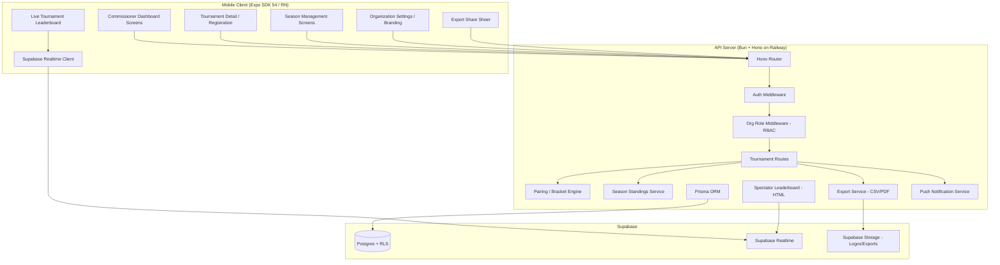
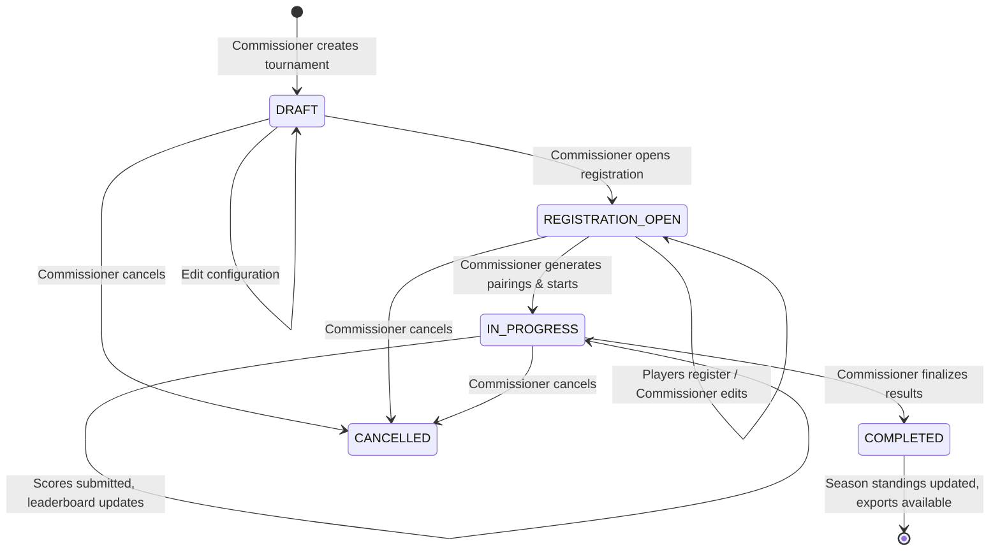
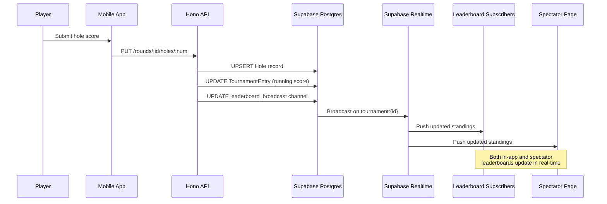
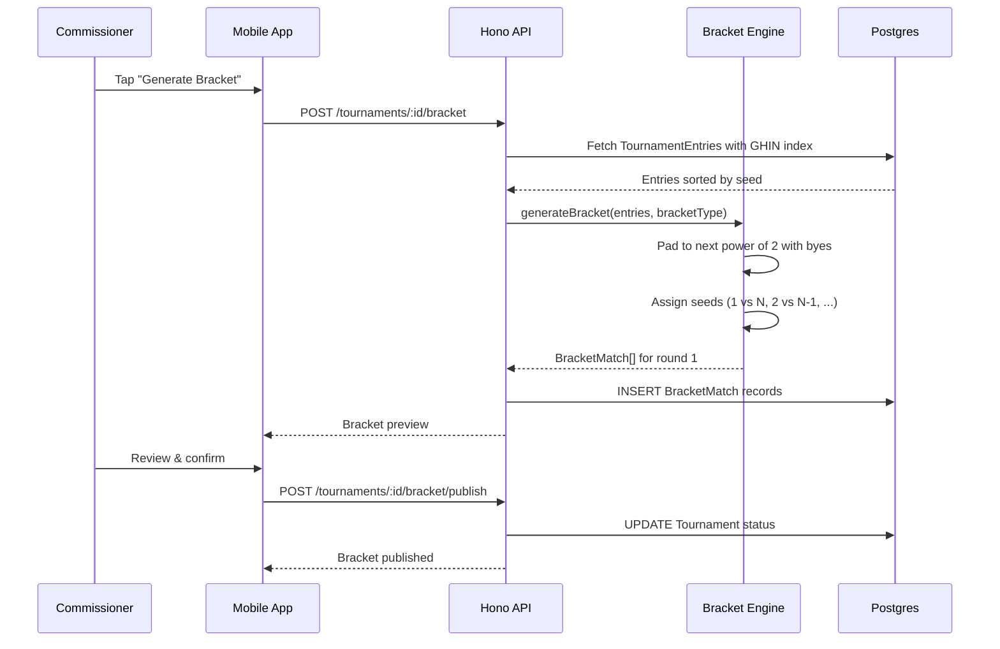

# Design Document: Sticks M3 — Tournament Engine

## Overview

M3 delivers the tournament engine — the primary technical deliverable of the Sticks platform. M1 shipped auth, onboarding, the data model, GPS scoring, a basic leaderboard, and a social feed. M2 hardened background location, offline sync, course geometry overlays, and tee time booking. M3 builds the white-label tournament and league management system that lets any golf organization run their competitive season through Sticks.

The work breaks into ten architectural areas:

1. **Tournament configuration** — CRUD for tournaments with 6 formats (STROKE_PLAY, MATCH_PLAY, STABLEFORD, SCRAMBLE, BEST_BALL, CHAPMAN), handicap modes (gross/net/both), flights by handicap range, multi-round with cut rules, and tee assignments.
2. **Player registration & roster** — self-service registration with auto-flight assignment by GHIN index, commissioner manual add/remove, unique constraint enforcement, and organization-level roster tracking.
3. **Bracket & pairing generation** — seeded stroke play pairings (groups of 2–4), single/double elimination brackets with bye handling for non-power-of-2 counts, round-robin group play, re-seeding between rounds, and commissioner review before publish.
4. **Commissioner dashboard** — mobile screens for tournament lifecycle management: config, registration, pairings, announcements (push notifications), result finalization, score disputes, manual score edits with audit logging, and real-time scoring progress.
5. **Live tournament leaderboard** — real-time updates via Supabase Realtime channels scoped per tournament, flight filtering, net/gross toggle, podium treatment, "My Position" sticky card, freeze/unfreeze, and match play bracket view.
6. **Public spectator leaderboard** — server-rendered HTML page served by the Hono API at `/leaderboard/:tournamentId`, no auth required, real-time via Supabase Realtime JS client, responsive, org-branded.
7. **White label branding** — Org_Config (logo, primary/secondary/accent colors) stored as JSON on Organization, applied to in-app tournament screens and spectator leaderboard, with fallback to default Sticks theme.
8. **Season management** — season CRUD, configurable points system, drop-worst-round rules, cumulative standings computed on tournament finalization, season roster management, and season finalization.
9. **RBAC** — OrgMembership model with COMMISSIONER, COACH, ADMIN, PLAYER roles; middleware that resolves org-level permissions per request; coaches/admins excluded from competition.
10. **Scoring export** — CSV and PDF generation for finalized tournaments with configurable field mapping, org branding in PDF header, state association templates, and 24-hour download URLs.

### Key Design Decisions

- **Extend, don't replace**: All existing M1/M2 models (Tournament, TournamentEntry, Season, Organization) are extended with new columns. No breaking changes.
- **CHAPMAN added to ScoringMode enum**: The existing enum gains a sixth value. All existing STROKE_PLAY/MATCH_PLAY/etc. data remains valid.
- **OrgMembership as the RBAC pivot**: A new join table between User and Organization carries the role enum. The auth middleware is extended with an `orgRoleMiddleware` that resolves the user's role for a given org context.
- **Supabase Realtime channels scoped per tournament**: Each active tournament gets a channel `tournament:{id}`. Score submissions broadcast to this channel. This avoids a single global channel bottleneck.
- **Spectator leaderboard as server-rendered HTML**: The Hono API serves a self-contained HTML page with inline CSS and a Supabase Realtime JS client loaded from CDN. No React SSR — just a simple template rendered with tournament data and org branding.
- **Bracket/pairing data as structured Prisma models**: `Pairing` and `BracketMatch` are first-class tables, not JSON blobs. This enables efficient queries for bracket progression and pairing lookups.
- **PDF generation via `@react-pdf/renderer` on the server**: Bun-compatible, produces branded scorecards. CSV is generated with a simple string builder.
- **Season standings computed on finalization, cached as JSON**: When a tournament is finalized, standings are recomputed and cached on the Season record. This avoids expensive aggregation queries on every standings view.

## Architecture

### System Architecture (M3 Additions)



### Tournament Lifecycle Flow



### Score Submission → Leaderboard Update Flow



### Bracket Generation Flow (Match Play)



## Components and Interfaces

### 1. Tournament Configuration API

New route file: `apps/api/src/routes/tournaments.ts`

```typescript
// POST /tournaments — create tournament
interface CreateTournamentBody {
  organizationId: string;
  name: string;
  format: 'STROKE_PLAY' | 'MATCH_PLAY' | 'STABLEFORD' | 'SCRAMBLE' | 'BEST_BALL' | 'CHAPMAN';
  handicapMode: 'gross' | 'net' | 'both';
  handicapAllowance?: number; // 0-100, default 100
  startDate: string;
  endDate: string;
  prizePool?: number;
  hostingType: 'STICKS_HOSTED' | 'SELF_HOSTED';
  bracketType?: 'SINGLE_ELIMINATION' | 'DOUBLE_ELIMINATION' | 'ROUND_ROBIN' | null;
  flightConfig?: { flights: { name: string; minHandicap: number; maxHandicap: number }[] };
  multiRoundConfig?: { numberOfRounds: number; cutRule?: { threshold: number; afterRound: number }; carryForward: boolean };
  teeAssignment?: Record<string, string>; // flightName or playerId → tee name
  seasonId?: string;
}

// PUT /tournaments/:id — update tournament (respects status restrictions)
// GET /tournaments/:id — get tournament detail
// GET /tournaments?organizationId=X&status=Y — list tournaments
// POST /tournaments/:id/status — transition tournament status
```

### 2. Registration & Roster API

```typescript
// POST /tournaments/:id/register — player self-registration
// DELETE /tournaments/:id/register — player withdrawal
// POST /tournaments/:id/entries — commissioner adds player
// DELETE /tournaments/:id/entries/:entryId — commissioner removes player
// GET /tournaments/:id/entries — list entries with flight, handicap, payment status
// GET /organizations/:id/roster — org-level roster (all players who've participated)
```

### 3. Pairing & Bracket Engine

New service: `apps/api/src/services/pairingEngine.ts`

```typescript
interface SeedEntry {
  entryId: string;
  userId: string;
  ghinIndex: number | null;
  manualSeed?: number;
}

interface PairingResult {
  roundNumber: number;
  groups: { groupNumber: number; entryIds: string[] }[];
}

interface BracketMatchResult {
  roundNumber: number;
  matchNumber: number;
  entry1Id: string | null; // null = bye
  entry2Id: string | null;
  isBye: boolean;
}

// Stroke play: group by seed into groups of 2-4
function generateStrokePlayPairings(entries: SeedEntry[], groupSize: number): PairingResult;

// Match play: seeded bracket with byes
function generateBracket(entries: SeedEntry[], bracketType: 'SINGLE_ELIMINATION' | 'DOUBLE_ELIMINATION'): BracketMatchResult[];

// Round robin: balanced groups
function generateRoundRobinGroups(entries: SeedEntry[], groupCount: number): PairingResult;

// Re-seed between rounds based on current standings
function reseedFromStandings(entries: SeedEntry[], standings: { entryId: string; score: number }[]): SeedEntry[];
```

Bracket generation algorithm:
1. Sort entries by seed (GHIN index ascending, or manual seed, or previous results).
2. Compute next power of 2 ≥ entry count. Difference = number of byes.
3. Assign byes to top seeds (lowest GHIN index).
4. Pair seeds: 1 vs N, 2 vs N-1, etc. (standard tournament seeding).
5. For double elimination: create winners bracket and losers bracket structures.
6. Persist as `BracketMatch` records with round number and match number.

### 4. Commissioner Dashboard Screens

Mobile screens in `apps/mobile/src/screens/commissioner/`:

- **CommissionerHomeScreen** — list of tournaments grouped by status (DRAFT, REGISTRATION_OPEN, IN_PROGRESS, COMPLETED)
- **TournamentConfigScreen** — create/edit tournament form
- **RegistrationListScreen** — registered players with flight, handicap, payment status; add/remove controls
- **PairingPreviewScreen** — generated pairings/bracket for review; drag-and-drop swap; confirm/publish
- **AnnouncementScreen** — text input → push notification to all registered players
- **ResultsScreen** — finalize results, view final standings
- **DisputeListScreen** — list of score disputes with resolution controls
- **ScoreEditScreen** — hole-by-hole score editor with audit logging
- **ScoringProgressScreen** — real-time view of which players have submitted scores per hole
- **SeasonConfigScreen** — create/edit season, points system, drop-worst config
- **SeasonStandingsScreen** — cumulative standings table
- **OrgSettingsScreen** — logo upload, color scheme picker, org name
- **RoleManagementScreen** — invite users, assign roles

### 5. Live Tournament Leaderboard

Extends `apps/mobile/src/screens/LeaderboardScreen.tsx` with a tournament-specific mode:

```typescript
interface TournamentLeaderboardEntry {
  rank: number;
  entryId: string;
  userId: string;
  firstName: string;
  lastName: string;
  avatarUrl: string | null;
  flight: string | null;
  scoreRelToPar: number;
  grossScore: number;
  netScore: number | null;
  thru: number; // holes completed in current round
  movement: 'up' | 'down' | 'unchanged';
  // Match play additions
  matchStatus?: string; // e.g., "2 UP", "AS", "3 & 2"
  bracketRound?: number;
}
```

Supabase Realtime subscription pattern:
```typescript
const channel = supabase
  .channel(`tournament:${tournamentId}`)
  .on('broadcast', { event: 'leaderboard_update' }, (payload) => {
    // Update local leaderboard state
  })
  .subscribe();
```

Features:
- Flight filter tabs (All, A Flight, B Flight, C Flight)
- Net/Gross toggle (when handicapMode = 'both')
- Top 3 podium with gold (#e9c349), silver (#c0c0c0), bronze (#cd7f32) indicators
- "My Position" sticky card (reuses existing pattern from LeaderboardScreen)
- "Leaderboard paused" banner when `leaderboardFrozen = true`
- Match play bracket view showing bracket progression

### 6. Spectator Leaderboard (Server-Rendered HTML)

New route: `apps/api/src/routes/spectator.ts`

The Hono API serves a self-contained HTML page at `GET /leaderboard/:tournamentId`. No auth required — this route is excluded from the auth middleware.

```typescript
// GET /leaderboard/:tournamentId — public spectator page
// Returns HTML with:
// - Inline CSS using org branding colors (or Sticks defaults)
// - Tournament header: org logo, org name, tournament name, round, dates
// - Leaderboard table: rank, name, score, thru, movement
// - Supabase Realtime JS client (CDN) for live updates
// - "Leaderboard paused" indicator when frozen
// - Responsive layout (mobile-first)
// - 404-style page for DRAFT or non-existent tournaments
```

Template structure:
```html
<!DOCTYPE html>
<html>
<head>
  <meta charset="utf-8">
  <meta name="viewport" content="width=device-width, initial-scale=1">
  <title>${tournamentName} — ${orgName} Leaderboard</title>
  <style>
    :root {
      --primary: ${orgConfig?.primary || '#84d7af'};
      --secondary: ${orgConfig?.secondary || '#006747'};
      --accent: ${orgConfig?.accent || '#e9c349'};
    }
    /* Responsive leaderboard styles */
  </style>
</head>
<body>
  <header>
    
    <h1>${tournamentName}</h1>
    <p>Round ${currentRound} · ${dateRange}</p>
  </header>
  <div id="leaderboard"><!-- Server-rendered initial data --></div>
  <script src="https://cdn.jsdelivr.net/npm/@supabase/supabase-js@2/dist/umd/supabase.min.js"></script>
  <script>
    const supabase = window.supabase.createClient('${supabaseUrl}', '${supabaseAnonKey}');
    const channel = supabase.channel('tournament:${tournamentId}')
      .on('broadcast', { event: 'leaderboard_update' }, (payload) => {
        // Re-render leaderboard table from payload
      })
      .subscribe();
  </script>
</body>
</html>
```

### 7. White Label Branding System

Org_Config stored on Organization.colorScheme JSON field:

```typescript
interface OrgConfig {
  primary: string;   // hex color, e.g., "#1a5c3a"
  secondary: string; // hex color
  accent: string;    // hex color
}
```

- `Organization.logoUrl` — URL to logo in Supabase Storage (PNG/JPEG, < 2MB)
- `Organization.colorScheme` — JSON with primary, secondary, accent hex values
- Mobile app reads org config when displaying tournament screens and applies colors via dynamic StyleSheet
- Spectator leaderboard injects colors as CSS custom properties
- Fallback: when `colorScheme` is null, use Sticks defaults (`#84d7af`, `#006747`, `#e9c349`)

Logo upload endpoint:
```typescript
// POST /organizations/:id/logo — upload logo image
// Validates: PNG or JPEG, < 2MB
// Stores in Supabase Storage bucket "org-logos"
// Updates Organization.logoUrl
```

### 8. Season Standings Service

New service: `apps/api/src/services/seasonService.ts`

```typescript
interface PointsSystemConfig {
  positions: { position: number; points: number }[];
  // e.g., [{ position: 1, points: 100 }, { position: 2, points: 90 }, ...]
}

interface StandingsEntry {
  userId: string;
  firstName: string;
  lastName: string;
  totalPoints: number;
  eventsPlayed: number;
  eventsCounted: number;
  rank: number;
}

function computeSeasonStandings(
  tournaments: FinalizedTournament[],
  pointsSystem: PointsSystemConfig,
  dropWorstRounds: number,
): StandingsEntry[];
```

Algorithm:
1. For each finalized tournament in the season, map finishing positions to points using the points system config.
2. For each player, collect all point values across tournaments.
3. If `dropWorstRounds > 0`, sort each player's points ascending and drop the lowest N.
4. Sum remaining points. Rank by total descending.
5. Cache result as JSON on `Season.standingsCache`.

### 9. RBAC Middleware

New middleware: `apps/api/src/middleware/orgRole.ts`

```typescript
type OrgRole = 'COMMISSIONER' | 'COACH' | 'ADMIN' | 'PLAYER';

// Resolves the user's role for a given organization
// Reads organizationId from route params, query, or request body
// Attaches orgRole to context
function orgRoleMiddleware(requiredRoles: OrgRole[]) {
  return async (c: Context, next: Next) => {
    const userId = c.get('userId'); // from auth middleware
    const orgId = resolveOrgId(c); // from params/query/body
    
    const membership = await prisma.orgMembership.findUnique({
      where: { organizationId_userId: { organizationId: orgId, userId } }
    });
    
    if (!membership || !requiredRoles.includes(membership.role)) {
      return c.json({ error: 'Insufficient permissions', statusCode: 403 }, 403);
    }
    
    c.set('orgRole', membership.role);
    await next();
  };
}
```

Role permissions matrix:

| Action | COMMISSIONER | ADMIN | COACH | PLAYER |
|--------|:---:|:---:|:---:|:---:|
| Create/edit tournament | ✓ | ✓ | ✗ | ✗ |
| Generate pairings | ✓ | ✓ | ✗ | ✗ |
| Finalize results | ✓ | ✓ | ✗ | ✗ |
| Post announcements | ✓ | ✓ | ✗ | ✗ |
| Resolve disputes | ✓ | ✓ | ✗ | ✗ |
| Edit scores | ✓ | ✓ | ✗ | ✗ |
| View roster/standings | ✓ | ✓ | ✓ | ✗ |
| View player scoring data | ✓ | ✓ | ✓ | ✗ |
| Register for tournament | ✗ | ✗ | ✗ | ✓ |
| Appear on leaderboard | ✗ | ✗ | ✗ | ✓ |
| Invite/assign roles | ✓ | ✗ | ✗ | ✗ |

### 10. Scoring Export Service

New service: `apps/api/src/services/exportService.ts`

```typescript
interface ExportFieldMapping {
  fields: { key: string; header: string }[];
  // e.g., [{ key: 'playerName', header: 'Player' }, { key: 'grossScore', header: 'Gross' }]
}

// CSV: generates comma-separated string with configurable columns
function generateCSV(tournament: TournamentWithResults, fieldMapping: ExportFieldMapping): string;

// PDF: generates branded scorecard document
function generatePDF(tournament: TournamentWithResults, orgConfig: OrgConfig | null): Promise<Buffer>;
```

Default CSV columns: Player Name, Handicap, Flight, Gross Score, Net Score, Hole 1–18 scores, Final Rank.

PDF layout:
- Header: Org logo + name, tournament name, date range
- Table: rank, player name, handicap, flight, gross, net, hole-by-hole scores
- Footer: "Powered by Sticks" (unless enterprise tier)

Export files are uploaded to Supabase Storage bucket `exports` with a 24-hour expiry signed URL.

### API Endpoints (M3)

| Method | Path | Auth | Description |
|--------|------|------|-------------|
| POST | `/tournaments` | COMMISSIONER/ADMIN | Create tournament |
| GET | `/tournaments/:id` | Authenticated | Get tournament detail |
| PUT | `/tournaments/:id` | COMMISSIONER/ADMIN | Update tournament |
| GET | `/tournaments` | Authenticated | List tournaments (by org, status) |
| POST | `/tournaments/:id/status` | COMMISSIONER/ADMIN | Transition status |
| POST | `/tournaments/:id/register` | PLAYER | Self-register |
| DELETE | `/tournaments/:id/register` | PLAYER | Withdraw |
| POST | `/tournaments/:id/entries` | COMMISSIONER/ADMIN | Add player |
| DELETE | `/tournaments/:id/entries/:entryId` | COMMISSIONER/ADMIN | Remove player |
| GET | `/tournaments/:id/entries` | Authenticated | List entries |
| POST | `/tournaments/:id/pairings` | COMMISSIONER/ADMIN | Generate pairings |
| POST | `/tournaments/:id/bracket` | COMMISSIONER/ADMIN | Generate bracket |
| PUT | `/tournaments/:id/pairings` | COMMISSIONER/ADMIN | Swap players |
| POST | `/tournaments/:id/pairings/publish` | COMMISSIONER/ADMIN | Publish draw |
| POST | `/tournaments/:id/bracket/publish` | COMMISSIONER/ADMIN | Publish bracket |
| POST | `/tournaments/:id/announce` | COMMISSIONER/ADMIN | Post announcement |
| POST | `/tournaments/:id/finalize` | COMMISSIONER/ADMIN | Finalize results |
| GET | `/tournaments/:id/disputes` | COMMISSIONER/ADMIN | List disputes |
| POST | `/tournaments/:id/disputes` | PLAYER | Submit dispute |
| PUT | `/tournaments/:id/disputes/:disputeId` | COMMISSIONER/ADMIN | Resolve dispute |
| PUT | `/tournaments/:id/entries/:entryId/scores` | COMMISSIONER/ADMIN | Manual score edit |
| GET | `/tournaments/:id/leaderboard` | Authenticated | Tournament leaderboard |
| POST | `/tournaments/:id/leaderboard/freeze` | COMMISSIONER/ADMIN | Freeze leaderboard |
| POST | `/tournaments/:id/leaderboard/unfreeze` | COMMISSIONER/ADMIN | Unfreeze leaderboard |
| GET | `/tournaments/:id/export/csv` | COMMISSIONER/ADMIN | Export CSV |
| GET | `/tournaments/:id/export/pdf` | COMMISSIONER/ADMIN | Export PDF |
| POST | `/seasons` | COMMISSIONER/ADMIN | Create season |
| GET | `/seasons/:id` | Authenticated | Get season detail |
| PUT | `/seasons/:id` | COMMISSIONER/ADMIN | Update season |
| GET | `/seasons/:id/standings` | Authenticated | Get standings |
| POST | `/seasons/:id/finalize` | COMMISSIONER/ADMIN | Finalize season |
| POST | `/seasons/:id/roster` | COMMISSIONER/ADMIN | Add to roster |
| DELETE | `/seasons/:id/roster/:userId` | COMMISSIONER/ADMIN | Remove from roster |
| POST | `/organizations/:id/logo` | COMMISSIONER | Upload logo |
| PUT | `/organizations/:id/branding` | COMMISSIONER | Update branding |
| GET | `/organizations/:id/roster` | COMMISSIONER/ADMIN/COACH | Org roster |
| POST | `/organizations/:id/members` | COMMISSIONER | Invite member |
| PUT | `/organizations/:id/members/:memberId` | COMMISSIONER | Update role |
| GET | `/leaderboard/:tournamentId` | Public (no auth) | Spectator leaderboard HTML |


## Data Models

### New Enums

```prisma
// Add to existing ScoringMode enum
enum ScoringMode {
  STROKE_PLAY
  MATCH_PLAY
  STABLEFORD
  SCRAMBLE
  BEST_BALL
  CHAPMAN        // NEW
}

// New enums
enum HostingType {
  STICKS_HOSTED
  SELF_HOSTED
}

enum BracketType {
  SINGLE_ELIMINATION
  DOUBLE_ELIMINATION
  ROUND_ROBIN
}

enum OrgRole {
  COMMISSIONER
  COACH
  ADMIN
  PLAYER
}

enum DisputeStatus {
  OPEN
  RESOLVED
  DISMISSED
}

enum MatchResult {
  WIN
  LOSS
  HALVED
  BYE
}

enum EliminationStatus {
  ACTIVE
  ELIMINATED
  WITHDRAWN
}

// Extended FeedEventType
enum FeedEventType {
  ROUND_COMPLETED
  LEADERBOARD_MOVE
  BET_SETTLED
  TOURNAMENT_RESULT
  CREW_ACTIVITY
  RIVALRY_MILESTONE
  BRACKET_ADVANCEMENT
  TOURNAMENT_ANNOUNCEMENT  // NEW
  SCORE_DISPUTE_RESOLVED   // NEW
}
```

### Extended Tournament Model

```prisma
model Tournament {
  id                  String           @id @default(uuid())
  organizationId      String
  seasonId            String?
  name                String
  format              ScoringMode      @default(STROKE_PLAY)
  handicapMode        String?          // 'gross' | 'net' | 'both'
  status              TournamentStatus @default(DRAFT)
  flightConfig        Json?            // { flights: [{ name, minHandicap, maxHandicap }] }
  prizePool           Float?
  startDate           DateTime?
  endDate             DateTime?
  // ── M3 additions ──
  hostingType         HostingType      @default(STICKS_HOSTED)
  bracketType         BracketType?
  handicapAllowance   Float            @default(100) // percentage 0-100
  teeAssignment       Json?            // { flightOrPlayerId: teeName }
  multiRoundConfig    Json?            // { numberOfRounds, cutRule: { threshold, afterRound }, carryForward }
  leaderboardFrozen   Boolean          @default(false)
  currentRound        Int              @default(1)
  // ── end M3 ──
  createdAt           DateTime         @default(now())
  updatedAt           DateTime         @updatedAt

  organization        Organization     @relation(fields: [organizationId], references: [id])
  season              Season?          @relation(fields: [seasonId], references: [id])
  entries             TournamentEntry[]
  rounds              Round[]
  pairings            Pairing[]
  bracketMatches      BracketMatch[]
  scoreAuditLogs      ScoreAuditLog[]
  scoreDisputes       ScoreDispute[]
}
```

### Extended TournamentEntry Model

```prisma
model TournamentEntry {
  id                String            @id @default(uuid())
  tournamentId      String
  userId            String
  flight            String?
  tee               String?
  paymentStatus     String?
  score             Int?
  bracketPos        Int?
  // ── M3 additions ──
  seedPosition      Int?
  netScore          Int?
  pointsEarned      Float?
  matchResult       MatchResult?
  eliminationStatus EliminationStatus @default(ACTIVE)
  thru              Int               @default(0) // holes completed current round
  scoreRelToPar     Int               @default(0)
  // ── end M3 ──
  createdAt         DateTime          @default(now())

  tournament        Tournament        @relation(fields: [tournamentId], references: [id])
  user              User              @relation(fields: [userId], references: [id])

  pairingSlots      PairingSlot[]
  bracketAsPlayer1  BracketMatch[]    @relation("player1")
  bracketAsPlayer2  BracketMatch[]    @relation("player2")
  bracketAsWinner   BracketMatch[]    @relation("winner")
  scoreAuditLogs    ScoreAuditLog[]
  scoreDisputes     ScoreDispute[]

  @@unique([tournamentId, userId])
}
```

### New Pairing Model

```prisma
model Pairing {
  id            String        @id @default(uuid())
  tournamentId  String
  roundNumber   Int
  groupNumber   Int
  createdAt     DateTime      @default(now())

  tournament    Tournament    @relation(fields: [tournamentId], references: [id])
  slots         PairingSlot[]

  @@unique([tournamentId, roundNumber, groupNumber])
}

model PairingSlot {
  id          String          @id @default(uuid())
  pairingId   String
  entryId     String
  slotOrder   Int             // position within the group

  pairing     Pairing         @relation(fields: [pairingId], references: [id])
  entry       TournamentEntry @relation(fields: [entryId], references: [id])

  @@unique([pairingId, entryId])
}
```

### New BracketMatch Model

```prisma
model BracketMatch {
  id            String           @id @default(uuid())
  tournamentId  String
  roundNumber   Int
  matchNumber   Int
  entry1Id      String?          // null if bye slot
  entry2Id      String?          // null if bye slot
  winnerId      String?
  isBye         Boolean          @default(false)
  matchScore    String?          // e.g., "3 & 2", "1 UP", "19 holes"
  bracketSide   String?          // 'winners' | 'losers' (for double elimination)
  createdAt     DateTime         @default(now())
  updatedAt     DateTime         @updatedAt

  tournament    Tournament       @relation(fields: [tournamentId], references: [id])
  entry1        TournamentEntry? @relation("player1", fields: [entry1Id], references: [id])
  entry2        TournamentEntry? @relation("player2", fields: [entry2Id], references: [id])
  winner        TournamentEntry? @relation("winner", fields: [winnerId], references: [id])

  @@unique([tournamentId, roundNumber, matchNumber])
}
```

### New OrgMembership Model

```prisma
model OrgMembership {
  id              String       @id @default(uuid())
  organizationId  String
  userId          String
  role            OrgRole      @default(PLAYER)
  createdAt       DateTime     @default(now())
  updatedAt       DateTime     @updatedAt

  organization    Organization @relation(fields: [organizationId], references: [id])
  user            User         @relation(fields: [userId], references: [id])

  @@unique([organizationId, userId])
}
```

### New ScoreAuditLog Model

```prisma
model ScoreAuditLog {
  id            String          @id @default(uuid())
  tournamentId  String
  entryId       String
  holeNumber    Int
  originalValue Int
  newValue      Int
  editedById    String
  createdAt     DateTime        @default(now())

  tournament    Tournament      @relation(fields: [tournamentId], references: [id])
  entry         TournamentEntry @relation(fields: [entryId], references: [id])
  editedBy      User            @relation("scoreEdits", fields: [editedById], references: [id])

  @@index([tournamentId])
  @@index([entryId])
}
```

### New ScoreDispute Model

```prisma
model ScoreDispute {
  id              String          @id @default(uuid())
  tournamentId    String
  entryId         String
  holeNumber      Int
  claimedScore    Int
  recordedScore   Int
  evidenceUrl     String?
  status          DisputeStatus   @default(OPEN)
  resolvedById    String?
  resolutionNotes String?
  createdAt       DateTime        @default(now())
  updatedAt       DateTime        @updatedAt

  tournament      Tournament      @relation(fields: [tournamentId], references: [id])
  entry           TournamentEntry @relation(fields: [entryId], references: [id])
  resolvedBy      User?           @relation("disputeResolutions", fields: [resolvedById], references: [id])

  @@index([tournamentId])
  @@index([entryId])
}
```

### Extended Season Model

```prisma
model Season {
  id              String       @id @default(uuid())
  organizationId  String
  name            String
  pointsSystem    Json?        // PointsSystemConfig
  dropWorstRounds Int?
  startDate       DateTime?
  endDate         DateTime?
  // ── M3 additions ──
  finalized       Boolean      @default(false)
  standingsCache  Json?        // StandingsEntry[] cached on finalization
  // ── end M3 ──
  createdAt       DateTime     @default(now())
  updatedAt       DateTime     @updatedAt

  organization    Organization @relation(fields: [organizationId], references: [id])
  tournaments     Tournament[]
}
```

### Extended Organization Model

```prisma
model Organization {
  id          String          @id @default(uuid())
  name        String
  logoUrl     String?
  colorScheme Json?           // OrgConfig: { primary, secondary, accent }
  domain      String?
  tier        String?
  createdAt   DateTime        @default(now())
  updatedAt   DateTime        @updatedAt

  tournaments Tournament[]
  seasons     Season[]
  feedEvents  FeedEvent[]
  memberships OrgMembership[] // NEW
}
```

### Extended User Model (new relations)

```prisma
model User {
  // ... existing fields unchanged ...

  // ── M3 additions ──
  orgMemberships    OrgMembership[]
  scoreEdits        ScoreAuditLog[]   @relation("scoreEdits")
  disputeResolutions ScoreDispute[]   @relation("disputeResolutions")
  // ── end M3 ──
}
```

