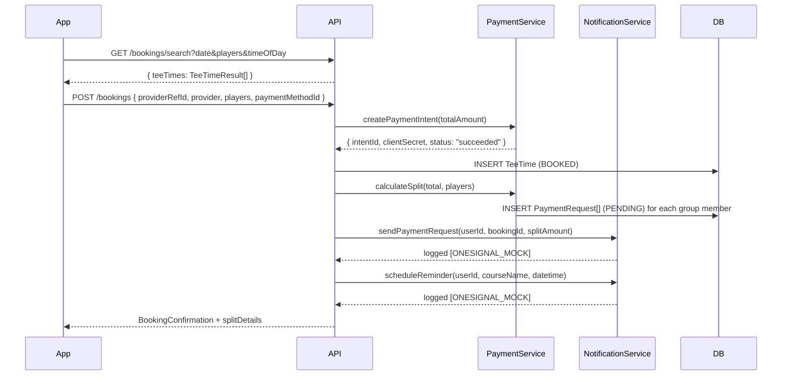

# Design Document: Tee Time Booking V2

## Overview

Tee Time Booking V2 replaces the single-file `TeeTimeScreen.tsx` (which currently handles search, confirm, success, and history in one component with a `ScreenMode` state machine) with a proper multi-screen navigation flow. The new flow spans five dedicated screens wired into the existing `PlayStack` navigator, backed by an extended API service layer that adds split payment orchestration and a mock notification service.

All external integrations — foreUP, Stripe, OneSignal — are mocked at the service layer boundary. The mock implementations satisfy the same TypeScript interfaces as the real implementations will, so swapping them in later requires only replacing the internals of the provider classes, not any calling code.

The feature targets four Utah courses (Bonneville Golf Course, Soldier Hollow, East Bay, Stonebridge) with deterministic mock tee time data that covers morning, afternoon, and twilight slots at realistic price points.

### Key Design Decisions

- **Screens over state machine**: The existing `TeeTimeScreen` uses a `ScreenMode` union to render different views in one component. V2 replaces this with proper React Navigation screens so each screen has its own lifecycle, back-stack behavior, and deep-link address.
- **API-first split payment**: Split payment logic lives entirely on the API server (`PaymentService`), not in the mobile client. The mobile client only displays amounts it receives from the API.
- **Mock-at-the-boundary**: Stripe and OneSignal mocks implement the same interfaces as the real integrations. No conditional logic in calling code — the mock is the real thing for now.
- **Deterministic mock data**: The existing `ForeUpProvider` uses `Math.random()` for spot counts, which makes tests flaky. V2 mock data is a static array, making search results predictable for demos and tests.

---

## Architecture

```mermaid
graph TD
    subgraph Mobile [React Native App]
        SS[SearchScreen]
        CDS[CourseDetailScreen]
        CS[ConfirmationScreen]
        SCS[SuccessScreen]
        SPS[SplitPaymentScreen]
        SS -->|select tee time| CDS
        CDS -->|Book Now| CS
        CS -->|payment success| SCS
        SCS -->|view history| SS
        SPS[SplitPaymentScreen]
    end

    subgraph PlayStack [PlayStack Navigator]
        SS
        CDS
        CS
        SCS
        SPS
    end

    subgraph API [Bun + Hono API]
        BR[/bookings routes]
        BS[BookingService]
        PS[PaymentService]
        NS[NotificationService]
        FP[ForeUpProvider - mock]
        BR --> BS
        BR --> PS
        BR --> NS
        BS --> FP
    end

    subgraph DB [Supabase Postgres]
        TT[(TeeTime)]
        PR[(PaymentRequest)]
        RM[(Reminder)]
    end

    Mobile -->|apiFetch| BR
    BS --> TT
    PS --> PR
    NS --> RM
```

### Data Flow: Organizer Booking



---

## Components and Interfaces

### Mobile Screens

#### SearchScreen (`TeeTimeScreen.tsx` — refactored)

Replaces the existing `TeeTimeScreen` search mode. Becomes the entry point of the PlayStack tee time flow.

```typescript
// Navigation params: none (entry screen)
interface SearchScreenProps {
  navigation: NativeStackNavigationProp<PlayStackParamList, 'TeeTimes'>;
}
```

UI elements:
- Date picker: horizontal scroll of 14 days (today + 13), each day is a tappable chip
- Player count selector: 1–4 pill buttons, default 2
- Time-of-day filter: Morning / Afternoon / Twilight segmented control
- Results list: `FlatList` of `TeeTimeCard` components
- Loading, empty, and error states

#### CourseDetailScreen (`CourseDetailScreen.tsx` — new)

Displays course info and price breakdown for a selected tee time.

```typescript
interface CourseDetailScreenParams {
  teeTime: TeeTimeResult;
  playerCount: number;
}
```

UI elements:
- Course name (heading), description placeholder
- Selected tee time and date
- Price breakdown: per-player × count = total
- "Book Now" CTA → navigates to ConfirmationScreen
- Back chevron → SearchScreen

#### ConfirmationScreen (`ConfirmationScreen.tsx` — new)

Full booking summary + mock payment form. Organizer pays the full amount here.

```typescript
interface ConfirmationScreenParams {
  teeTime: TeeTimeResult;
  playerCount: number;
}
```

UI elements:
- Booking summary card (course, date, time, players, total)
- Per-player split amount shown when `playerCount > 1`
- Mock card input placeholder (static UI, no real Stripe SDK yet)
- "Pay $XX.XX" button → calls `POST /bookings`
- Loading state during payment processing
- Error state with retry

#### SuccessScreen (`SuccessScreen.tsx` — new)

Shown after organizer payment succeeds.

```typescript
interface SuccessScreenParams {
  confirmation: BookingConfirmation;
  splitDetails?: SplitDetails;
}
```

UI elements:
- Check-circle icon (green)
- Course name, date/time, player count, total paid
- Confirmation number badge
- "Back to Tee Times" button → pops to SearchScreen
- "View My Bookings" button → navigates to booking history

#### SplitPaymentScreen (`SplitPaymentScreen.tsx` — new)

Shown to group members who tap a payment request notification. Also accessible from booking history.

```typescript
interface SplitPaymentScreenParams {
  bookingId: string;
  paymentRequestId: string;
}
```

UI elements:
- Course name, tee time, total booking amount
- Group member's split amount (prominent)
- "Pay $XX.XX" button → calls `POST /bookings/:id/split-pay`
- Status badge (PENDING / PAID / FAILED)

### Navigation Changes

The `PlayStack` in `BottomTabNavigator.tsx` gains four new screens:

```typescript
type PlayStackParamList = {
  PlayHome: undefined;
  Scoring: undefined;
  TeeTimes: undefined;                          // existing — now SearchScreen
  CourseDetail: { teeTime: TeeTimeResult; playerCount: number };
  Confirmation: { teeTime: TeeTimeResult; playerCount: number };
  Success: { confirmation: BookingConfirmation; splitDetails?: SplitDetails };
  SplitPayment: { bookingId: string; paymentRequestId: string };
};
```

Deep linking for `SplitPayment` is registered in `app.json` linking config so payment request notifications can open the screen directly.

### API Service Interfaces

#### PaymentService (new — `apps/api/src/services/paymentService.ts`)

```typescript
interface PaymentIntent {
  intentId: string;
  clientSecret: string;
  amount: number;
  status: 'requires_payment_method' | 'processing' | 'succeeded' | 'failed';
}

interface SplitDetails {
  totalAmount: number;
  playerCount: number;
  perPlayerAmount: number;
  paymentRequests: PaymentRequestRecord[];
}

interface PaymentRequestRecord {
  id: string;
  teeTimeId: string;
  userId: string;
  amount: number;
  status: 'PENDING' | 'PROCESSING' | 'PAID' | 'FAILED';
  dueAt: DateTime;
}

interface PaymentService {
  createPaymentIntent(amount: number, currency?: string): Promise<PaymentIntent>;
  confirmPayment(intentId: string): Promise<{ success: boolean; status: string }>;
  calculateSplit(totalAmount: number, playerCount: number): number;
  createSplitRequests(teeTimeId: string, organizerId: string, playerCount: number, totalAmount: number): Promise<SplitDetails>;
  processGroupMemberPayment(paymentRequestId: string): Promise<{ success: boolean }>;
  checkSettlement(teeTimeId: string): Promise<{ settled: boolean; pendingCount: number }>;
}
```

#### NotificationService (new — `apps/api/src/services/notificationService.ts`)

```typescript
interface NotificationService {
  sendBookingConfirmation(userId: string, courseName: string, datetime: string, amount: number): Promise<void>;
  sendPaymentRequest(userId: string, bookingId: string, paymentRequestId: string, splitAmount: number): Promise<void>;
  scheduleReminder(userId: string, teeTimeId: string, courseName: string, datetime: string): Promise<void>;
}
```

#### BookingService extensions

The existing `BookingService` gains two new parameters on `book()` and a new `splitPay()` method:

```typescript
// Extended book() signature
async book(
  providerRefId: string,
  provider: 'FOREUP' | 'GOLFNOW',
  userId: string,
  players: number,
  paymentMethodId: string,   // new — mock value accepted
): Promise<BookingConfirmation & { splitDetails?: SplitDetails }>

// New method
async splitPay(paymentRequestId: string, paymentMethodId: string): Promise<{ success: boolean }>
```

#### New API Routes

```
POST /bookings                    — extended: accepts paymentMethodId, returns splitDetails
POST /bookings/:id/split-pay      — new: group member pays their portion
GET  /bookings/:id/split-status   — new: organizer polls settlement status
```

---

## Data Models

### TeeTime (extended)

The existing `TeeTime` Prisma model gains two new fields:

```prisma
model TeeTime {
  // ... existing fields ...
  settlementStatus  SettlementStatus  @default(UNSETTLED)
  paymentIntentId   String?
  paymentRequests   PaymentRequest[]
}

enum SettlementStatus {
  UNSETTLED   // organizer paid, group members still owe
  SETTLED     // all group members have paid
  NA          // single-player booking, no split needed
}
```

### PaymentRequest (new model)

```prisma
model PaymentRequest {
  id              String               @id @default(uuid())
  teeTimeId       String
  userId          String
  amount          Float
  status          PaymentRequestStatus @default(PENDING)
  paymentIntentId String?
  dueAt           DateTime
  paidAt          DateTime?
  createdAt       DateTime             @default(now())
  updatedAt       DateTime             @updatedAt

  teeTime TeeTime @relation(fields: [teeTimeId], references: [id])
  user    User    @relation(fields: [userId], references: [id])

  @@index([teeTimeId])
  @@index([userId])
}

enum PaymentRequestStatus {
  PENDING
  PROCESSING
  PAID
  FAILED
}
```

### Mock Course Data Structure

The `ForeUpProvider` mock data is replaced with a static, deterministic dataset for the four target Utah courses:

```typescript
interface MockCourse {
  id: string;
  name: string;
  description: string;
  location: string;
  priceByTimeOfDay: {
    morning: number;    // before 12:00
    afternoon: number;  // 12:00–16:00
    twilight: number;   // after 16:00
  };
  teeTimes: MockTeeTimeSlot[];
}

interface MockTeeTimeSlot {
  time: string;         // HH:mm
  availableSpots: number;
}

// The four Utah courses
const UTAH_COURSES: MockCourse[] = [
  {
    id: 'bonneville-001',
    name: 'Bonneville Golf Course',
    description: 'A classic Salt Lake City municipal course with views of the Wasatch Front.',
    location: 'Salt Lake City, UT',
    priceByTimeOfDay: { morning: 45, afternoon: 38, twilight: 28 },
    teeTimes: [
      { time: '07:00', availableSpots: 4 },
      { time: '08:30', availableSpots: 2 },
      { time: '10:00', availableSpots: 3 },
      { time: '13:00', availableSpots: 4 },
      { time: '15:30', availableSpots: 2 },
      { time: '17:00', availableSpots: 4 },
    ],
  },
  {
    id: 'soldier-hollow-002',
    name: 'Soldier Hollow Golf Course',
    description: 'Olympic venue turned public course in the Heber Valley with mountain panoramas.',
    location: 'Midway, UT',
    priceByTimeOfDay: { morning: 55, afternoon: 48, twilight: 35 },
    teeTimes: [
      { time: '07:30', availableSpots: 4 },
      { time: '09:00', availableSpots: 3 },
      { time: '10:30', availableSpots: 2 },
      { time: '12:00', availableSpots: 4 },
      { time: '14:30', availableSpots: 3 },
      { time: '17:30', availableSpots: 4 },
    ],
  },
  {
    id: 'east-bay-003',
    name: 'East Bay Golf Course',
    description: 'Provo\'s premier public course along the shores of Utah Lake.',
    location: 'Provo, UT',
    priceByTimeOfDay: { morning: 40, afternoon: 35, twilight: 25 },
    teeTimes: [
      { time: '06:30', availableSpots: 4 },
      { time: '08:00', availableSpots: 2 },
      { time: '09:30', availableSpots: 4 },
      { time: '12:30', availableSpots: 3 },
      { time: '15:00', availableSpots: 4 },
      { time: '17:00', availableSpots: 2 },
    ],
  },
  {
    id: 'stonebridge-004',
    name: 'Stonebridge Golf Club',
    description: 'West Valley City\'s championship layout with challenging water features.',
    location: 'West Valley City, UT',
    priceByTimeOfDay: { morning: 50, afternoon: 42, twilight: 30 },
    teeTimes: [
      { time: '07:00', availableSpots: 3 },
      { time: '08:30', availableSpots: 4 },
      { time: '10:00', availableSpots: 2 },
      { time: '13:30', availableSpots: 4 },
      { time: '15:00', availableSpots: 3 },
      { time: '18:00', availableSpots: 4 },
    ],
  },
];
```

### TeeTimeResult (extended)

The existing `TeeTimeResult` interface gains a `courseDescription` field so `CourseDetailScreen` can display it without a second API call:

```typescript
interface TeeTimeResult {
  providerRefId: string;
  provider: 'FOREUP' | 'GOLFNOW';
  courseName: string;
  courseId: string;
  courseDescription: string;   // new
  datetime: string;
  availableSpots: number;
  pricePerPlayer: number;
  totalPrice: number;
}
```

### BookingConfirmation (extended)

```typescript
interface BookingConfirmation {
  providerRefId: string;
  confirmationNumber: string;
  provider: 'FOREUP' | 'GOLFNOW';
  courseName: string;
  datetime: string;
  players: number;
  totalPrice: number;
  splitDetails?: SplitDetails;   // new — present when players > 1
}
```

### Time-of-Day Filter Mapping

```typescript
type TimeOfDay = 'morning' | 'afternoon' | 'twilight';

const TIME_OF_DAY_RANGES: Record<TimeOfDay, { from: string; to: string }> = {
  morning:   { from: '00:00', to: '11:59' },
  afternoon: { from: '12:00', to: '15:59' },
  twilight:  { from: '16:00', to: '23:59' },
};
```

The `TeeTimeSearchParams` interface gains an optional `timeOfDay` field:

```typescript
interface TeeTimeSearchParams {
  date: string;
  courseId?: string;
  timeFrom?: string;
  timeTo?: string;
  timeOfDay?: TimeOfDay;   // new — maps to timeFrom/timeTo if provided
  players: number;
  lat?: number;
  lng?: number;
}
```

---

## Correctness Properties

*A property is a characteristic or behavior that should hold true across all valid executions of a system — essentially, a formal statement about what the system should do. Properties serve as the bridge between human-readable specifications and machine-verifiable correctness guarantees.*


### Property 1: Date range generation invariant

*For any* call to the date generation function with today's date as input, the result should be an array of exactly 15 dates (today through 14 days in the future), where every date is >= today and <= today + 14 days, and no date appears more than once.

**Validates: Requirements 1.1**

### Property 2: Search params completeness

*For any* combination of valid date string, player count (1–4), and timeOfDay filter, the search query string constructed by the mobile client should contain all three parameters with values that match the inputs.

**Validates: Requirements 1.4, 7.6**

### Property 3: Search results list length matches data

*For any* array of tee time results returned by the API, the number of rendered result cards in the `FlatList` should equal the length of the results array.

**Validates: Requirements 1.5**

### Property 4: Price breakdown calculation correctness

*For any* `TeeTimeResult` with a `pricePerPlayer` value and any player count between 1 and 4, the total price displayed on `CourseDetailScreen` and `ConfirmationScreen` should equal `pricePerPlayer * playerCount`, and when `playerCount > 1`, the per-player split amount displayed should equal `totalPrice / playerCount`.

**Validates: Requirements 2.2, 3.7**

### Property 5: Payment intent creation and confirmation round-trip

*For any* positive dollar amount, `createPaymentIntent(amount)` should return an object containing a non-empty `intentId`, a non-empty `clientSecret`, the same `amount` that was passed in, and a `status` field. Subsequently, calling `confirmPayment(intentId)` with the returned `intentId` should return an object with a `success` boolean field.

**Validates: Requirements 3.3, 8.1, 8.2**

### Property 6: Booking record created with BOOKED status

*For any* successful `book()` call with valid providerRefId, provider, userId, and playerCount, a `TeeTime` record should exist in the database with `bookingStatus = 'BOOKED'`, a non-null `confirmationNumber`, and a `playerCount` matching the input.

**Validates: Requirements 3.4**

### Property 7: Split calculation math

*For any* total amount and player count between 2 and 4, `calculateSplit(total, playerCount)` should return a value such that `perPlayerAmount * playerCount` equals `total` (within floating-point rounding to 2 decimal places), and `perPlayerAmount` should be strictly positive.

**Validates: Requirements 4.1, 8.3**

### Property 8: PaymentRequest records created with correct count and PENDING status

*For any* booking with `playerCount` between 2 and 4, after `createSplitRequests()` completes, the number of `PaymentRequest` records associated with that `TeeTime` should equal `playerCount - 1` (the organizer has already paid), and every created record should have `status = 'PENDING'` and a `dueAt` timestamp 24 hours after creation.

**Validates: Requirements 4.2**

### Property 9: Notification logging with ONESIGNAL_MOCK prefix

*For any* call to any `NotificationService` function (`sendBookingConfirmation`, `sendPaymentRequest`, `scheduleReminder`) with valid inputs, the function should complete without throwing and the console output should contain a line starting with `[ONESIGNAL_MOCK]` that includes the relevant payload fields (userId, courseName or bookingId, and amount or datetime as applicable).

**Validates: Requirements 4.3, 5.2, 9.4**

### Property 10: Settlement status updates when all members paid

*For any* `TeeTime` with `playerCount > 1`, after all associated `PaymentRequest` records have been updated to `status = 'PAID'`, calling `checkSettlement(teeTimeId)` should return `{ settled: true, pendingCount: 0 }` and the `TeeTime` record's `settlementStatus` should be `'SETTLED'`.

**Validates: Requirements 4.7**

### Property 11: Overdue payment request flagging

*For any* `PaymentRequest` with `status = 'PENDING'` and a `dueAt` timestamp that is in the past (relative to the current time), the record should be considered overdue and the organizer's booking detail view should render a visual overdue indicator for that request.

**Validates: Requirements 4.8**

### Property 12: PaymentRequest status transitions to PAID on success

*For any* `PaymentRequest` with `status = 'PENDING'`, after a successful `processGroupMemberPayment(paymentRequestId)` call, the `PaymentRequest` record's `status` should be `'PAID'` and `paidAt` should be a non-null timestamp.

**Validates: Requirements 4.9**

### Property 13: Success screen renders all required fields

*For any* `BookingConfirmation` object, the `SuccessScreen` rendered output should contain the course name, a formatted date/time string, the player count, the total price formatted as a dollar amount, and the confirmation number.

**Validates: Requirements 5.1**

### Property 14: Mock course data invariants

*For every* course in `UTAH_COURSES`, all of the following must hold simultaneously: the `teeTimes` array has length >= 5; every `priceByTimeOfDay` value is between $25 and $75 inclusive; every tee time slot's `availableSpots` is between 1 and 4 inclusive; and the `description` field is a non-empty string.

**Validates: Requirements 6.2, 6.3, 6.4, 6.5**

### Property 15: Search results conform to TeeTimeResult schema

*For any* valid `TeeTimeSearchParams`, every element in the array returned by `BookingService.search()` should have non-empty `providerRefId`, `provider` (one of 'FOREUP' or 'GOLFNOW'), `courseName`, `courseId`, `courseDescription`, `datetime` (valid ISO 8601), `availableSpots` >= `params.players`, `pricePerPlayer` > 0, and `totalPrice = pricePerPlayer * params.players`.

**Validates: Requirements 7.2**

### Property 16: Time-of-day filter correctly scopes results

*For any* search with `timeOfDay = 'morning'`, every result's tee time hour should be < 12. For `timeOfDay = 'afternoon'`, every result's hour should be >= 12 and < 16. For `timeOfDay = 'twilight'`, every result's hour should be >= 16. No result outside the corresponding time window should appear.

**Validates: Requirements 1.3, 7.6**

### Property 17: PaymentRequest status is always a valid enum value

*For any* `PaymentRequest` record at any point in its lifecycle, its `status` field should be exactly one of: `'PENDING'`, `'PROCESSING'`, `'PAID'`, or `'FAILED'`. No other value should ever be persisted.

**Validates: Requirements 8.4**

---

## Error Handling

### Mobile Client

| Scenario | Handling |
|---|---|
| Search request fails | Error state with retry button; error message shown |
| Search returns empty | Empty state with suggestion to adjust filters |
| Payment intent creation fails | Error message on ConfirmationScreen; retry allowed |
| Booking POST fails | Error message on ConfirmationScreen; user stays on screen |
| Split payment fails | Error message on SplitPaymentScreen; retry allowed |
| Deep link with invalid bookingId | Navigate to SearchScreen with toast error |
| Network timeout | Same as request failure — error state with retry |

### API Server

| Scenario | HTTP Status | Response |
|---|---|---|
| Invalid date format | 400 | `{ error: "Missing or invalid date (YYYY-MM-DD)" }` |
| players out of range | 400 | `{ error: "players must be between 1 and 4" }` |
| Invalid timeOfDay value | 400 | `{ error: "timeOfDay must be morning, afternoon, or twilight" }` |
| User not found | 404 | `{ error: "User not found" }` |
| TeeTime not found | 404 | `{ error: "Booking not found" }` |
| PaymentRequest not found | 404 | `{ error: "Payment request not found" }` |
| Payment intent creation fails | 500 | `{ error: "Payment processing failed" }` |
| Provider booking fails | 500 | `{ error: "Booking failed: <message>" }` |

### PaymentService Error States

- `createPaymentIntent` always succeeds in mock mode (returns `status: 'succeeded'`)
- `confirmPayment` always succeeds in mock mode
- When real Stripe is wired in, failures propagate as thrown errors caught by route handlers
- `PaymentRequest` status transitions: `PENDING → PROCESSING → PAID | FAILED`; no backward transitions allowed

### NotificationService Error Handling

- All mock functions are fire-and-forget — failures are logged but do not block the booking response
- This matches the production pattern where notification delivery failure should not fail a booking

---

## Testing Strategy

### Dual Testing Approach

Both unit tests and property-based tests are required. They are complementary:
- Unit tests catch concrete bugs with specific inputs and verify integration points
- Property tests verify universal correctness across the full input space

### Property-Based Testing

**Library**: `fast-check` (already available in the JS/TS ecosystem, works with Vitest)

Each property test runs a minimum of 100 iterations. Tests are tagged with a comment referencing the design property.

Each correctness property defined above maps to exactly one property-based test. Tag format:

```typescript
// Feature: tee-time-booking-v2, Property N: <property_text>
```

Example property test structure:

```typescript
import fc from 'fast-check';
import { describe, it, expect } from 'vitest';

describe('PaymentService', () => {
  // Feature: tee-time-booking-v2, Property 7: Split calculation math
  it('calculateSplit: perPlayerAmount * playerCount equals total', () => {
    fc.assert(
      fc.property(
        fc.float({ min: 10, max: 1000, noNaN: true }),
        fc.integer({ min: 2, max: 4 }),
        (total, playerCount) => {
          const perPlayer = paymentService.calculateSplit(total, playerCount);
          const reconstructed = Math.round(perPlayer * playerCount * 100) / 100;
          const roundedTotal = Math.round(total * 100) / 100;
          expect(reconstructed).toBe(roundedTotal);
          expect(perPlayer).toBeGreaterThan(0);
        }
      ),
      { numRuns: 100 }
    );
  });
});
```

### Property Tests by Layer

**API Service Layer** (`apps/api/src/services/__tests__/`):
- `paymentService.test.ts`: Properties 5, 7, 8, 10, 12, 17
- `notificationService.test.ts`: Property 9
- `bookingService.test.ts`: Properties 6, 15, 16
- `mockCourseData.test.ts`: Property 14

**Mobile Client** (`apps/mobile/src/screens/__tests__/`):
- `SearchScreen.test.ts`: Properties 1, 2, 3
- `CourseDetailScreen.test.ts`: Property 4
- `ConfirmationScreen.test.ts`: Property 4 (split display)
- `SuccessScreen.test.ts`: Property 13
- `SplitPaymentScreen.test.ts`: Property 11

### Unit Tests

Unit tests focus on specific examples, edge cases, and integration points that property tests don't cover well:

**API routes** (`apps/api/src/routes/__tests__/bookings.test.ts`):
- `GET /bookings/search` returns 400 for missing date
- `GET /bookings/search` returns 400 for players out of range
- `GET /bookings/search` returns 400 for invalid timeOfDay
- `POST /bookings` returns 201 with confirmation on success
- `POST /bookings/:id/split-pay` returns 200 on success
- `GET /bookings/:id/split-status` returns settlement state

**Mobile screens** (example-based):
- SearchScreen renders empty state when results array is empty (Req 1.8)
- SearchScreen renders error state with retry button on fetch failure (Req 1.9)
- ConfirmationScreen renders payment form elements (Req 3.2)
- ConfirmationScreen renders error message on payment failure (Req 3.6)
- SuccessScreen renders "Back to Tee Times" and "View My Bookings" buttons (Req 5.3, 5.4)
- Mock course data array has exactly 4 courses (Req 6.1)

### Test Configuration

```typescript
// vitest.config.ts (API)
export default defineConfig({
  test: {
    globals: true,
    environment: 'node',
  },
});
```

Property tests use `fc.assert(..., { numRuns: 100 })` as the minimum. Increase to 500 for critical payment calculation properties (Properties 5, 7).
